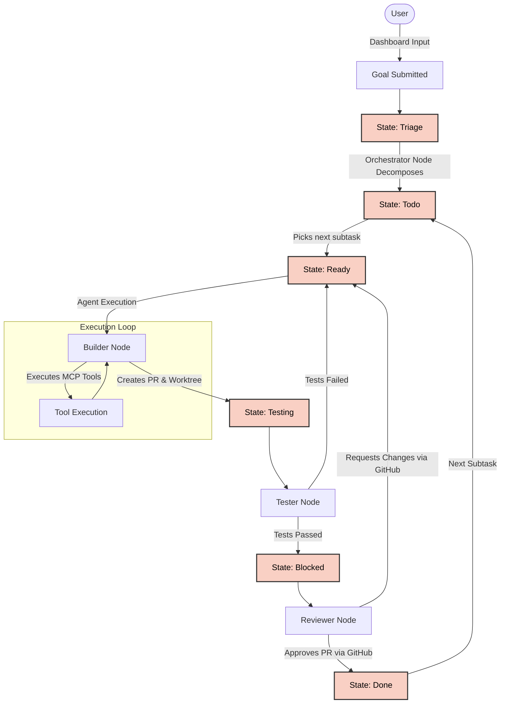

# Zero Factory

A 24/7 AI multi-agent orchestration system built on **LangGraph.js (TypeScript)** and **Bun**. Specialized agents form a complete software factory — from research to deployment, orchestrated by a robust state machine and monitored via a real-time Astro dashboard.

## Core Principles

| Pillar | Description |
|--------|-------------|
| **24/7 Development** | Continuous iterations with frequent reprioritization, rolling handoffs, and parallel execution |
| **Productivity & Automation** | Multi-agent workflows that automate routine tasks end-to-end |
| **Quality & Reliability** | High-quality, maintainable, secure software with layered review |
| **Cost Efficiency** | Optimized token usage via dynamic LLM routing and focused state-graph nodes |
| **Hybrid Review** | AI-assisted review at every stage, with human-in-the-loop insight for important decisions |
| **Single Source of Truth** | One canonical location for shared info. Link, don't copy. |
| **Minimalist** | Everything as small, simple, clean, and usable as possible |

## The Team (LangGraph Nodes)

Zero Factory operates using a specialized team of AI agent nodes, orchestrated by a Supervisor graph. By separating concerns, we ensure that agents don't get distracted by tasks outside their expertise.

| Node | Role | Core Responsibilities |
| :--- | :--- | :--- |
| **Orchestrator** | Pipeline Overseer | Receives the initial goal, decomposes it into sub-tasks (Todo List), manages handoffs, and tracks state via LangGraph persistence. |
| **Builder** | Senior Software Engineer | Writes the code and tests. Executes tool calls in a ReAct loop using `modelcontextprotocol/sdk` to run terminal commands, modify files, and create Git worktrees. |
| **Tester** | QA Automation | Executes `bun test` autonomously. If tests fail, bounces the code back to the Builder. If they pass, hands off to the Reviewer. |
| **Reviewer** | Quality Gatekeeper | Reviews PRs, checks for bugs, performance issues, and security flaws. Comments directly on GitHub and can bounce tasks back to the Builder. |

## Architecture & Workflow

The workflow uses a native **LangGraph State Machine** combined with SQLite-based persistence (`MemorySaver` / Checkpointer).



## Core Components

### 1. LangGraph Backend (`src/`)
Built with **Bun** and **LangGraph.js**, the backend exposes an API (`/api/start`, `/api/stream`) that manages the execution threads, preserves state via checkpoints, and dynamically binds MCP tools to the agent LLMs. It also statically serves the compiled Astro Dashboard.

### 2. Astro Dashboard (`dashboard/`)
A real-time, premium frontend built with **Astro**. It connects to the Bun API via **Server-Sent Events (SSE)** to stream real-time logs, syntax-highlighted tool calls, and visual pipeline states directly to the browser.

### 3. Model Context Protocol (MCP) Tools
The Builder node uses the `@modelcontextprotocol/sdk` to dynamically wrap local MCP servers (like the filesystem and terminal) into standard LangChain `DynamicTool` instances.

## Data Flow

1. **Goal Formulation**: User submits a goal or a **GitHub Issue URL** via the Astro Dashboard. If an issue URL is provided, the Orchestrator fetches the issue context directly.
2. **Auto-Triage**: The Orchestrator node uses structured LLM output (Zod) to break the goal down into `Todo` sub-tasks.
3. **Execution Setup**: The StateGraph promotes the task to `Ready`.
4. **Builder Execution**: The Builder picks up the task, provisions an isolated Git worktree, and enters a **ReAct loop** to execute tools.
5. **PR Creation & Testing**: The Builder pushes the branch and creates a real GitHub PR, moving to `Testing`. The Tester Node runs `bun test`. If tests fail, it loops back to the Builder.
6. **Continuous Polish**: The Reviewer analyzes the work and posts feedback via `gh pr review`. If it requests changes, it bounces back to `Ready`. If approved, it moves to `Done`.

## Setup Guide

- Linux machine (Raspberry Pi or x86_64)
- Bun 1.1+
- Node.js 22+
- Docker & Docker Compose (Optional)

### 1. Clone and Setup

```bash
git clone <repo-url> zerofactory
cd zerofactory
```

### 2. Install Dependencies

```bash
# Install backend dependencies
cd src
bun install

# Install dashboard dependencies
cd ../dashboard
bun install
```

### 3. Configure Environment
Set your API keys in the `src/.env` file:
```env
OPENAI_API_KEY=sk-...
ANTHROPIC_API_KEY=sk-...
```

### 4. Running the System (Development)

Run the backend API (Port 18780):
```bash
cd src
PORT=18780 bun run index.ts
```

Run the Astro Dashboard (Port 18781):
```bash
cd dashboard
bun run dev --host --port 18781
```

### 5. Running as Systemd Services (Production)
We provide `zerofactory-api.service` and `zerofactory-dashboard.service` files in the root repository.
```bash
sudo ln -s $(pwd)/zerofactory-api.service /etc/systemd/system/
sudo ln -s $(pwd)/zerofactory-dashboard.service /etc/systemd/system/
sudo systemctl daemon-reload
sudo systemctl enable --now zerofactory-api.service zerofactory-dashboard.service
```

To view the live logs for the services, use `journalctl`:
```bash
# View backend API logs
sudo journalctl -u zerofactory-api.service -f

# View dashboard logs
sudo journalctl -u zerofactory-dashboard.service -f
```

## License

See [LICENSE](LICENSE).
