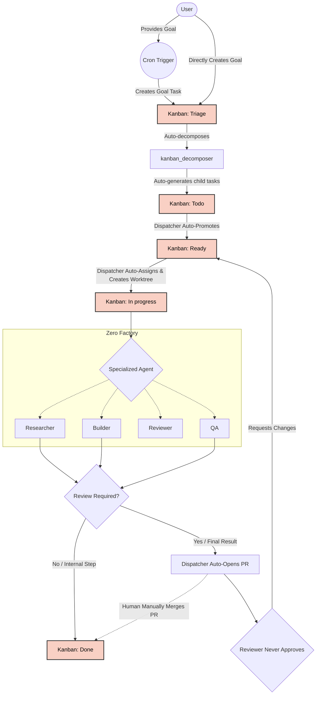

# Zero Factory

A 24/7 AI multi-agent orchestration system built on Hermes Agent. Six specialized agents form a complete software factory — from research to deployment.

## Core Principles

| Pillar | Description |
|--------|-------------|
| **24/7 Development** | Continuous iterations with frequent reprioritization, rolling handoffs, and parallel execution |
| **Productivity & Automation** | Multi-agent workflows that automate routine tasks end-to-end |
| **Quality & Reliability** | High-quality, maintainable, secure software with layered review |
| **Cost Efficiency** | Optimized token usage — each agent has only the skills it needs |
| **Hybrid Review** | AI-assisted review at every stage, with human-in-the-loop insight for important decisions |
| **Single Source of Truth** | One canonical location for shared info. Link, don't copy. |
| **Minimalist** | Everything as small, simple, clean, and usable as possible |
| **Living Documentation** | Always update the documentation in the same PR as the code changes. |

## The Team

Zero Factory operates using a specialized team of 6 AI agents, each with a distinct role, isolated toolset, and dedicated personality. By separating concerns, we ensure that agents don't get distracted by tasks outside their expertise, maximizing parallel efficiency and output quality.

| Agent & Configs | Role | Core Responsibilities |
| :--- | :--- | :--- |
| **Orchestrator**<br>[SOUL](profiles/orchestrator/SOUL.custom.md) \| [Config](profiles/orchestrator/config.custom.yaml) | Pipeline Overseer | Monitors the Kanban board, oversees the `kanban_decomposer` task breakdown, manages handoffs, and escalates blockers to the human. |
| **Researcher**<br>[SOUL](profiles/researcher/SOUL.custom.md) \| [Config](profiles/researcher/config.custom.yaml) | Technical Architect | Explores APIs, investigates optimal approaches, and writes detailed technical specs before coding begins. |
| **Builder**<br>[SOUL](profiles/builder/SOUL.custom.md) \| [Config](profiles/builder/config.custom.yaml) | Senior Software Engineer | Writes the code. Focuses heavily on speed, type-safety, tests, and shipping features. |
| **Reviewer**<br>[SOUL](profiles/reviewer/SOUL.custom.md) \| [Config](profiles/reviewer/config.custom.yaml) | Quality Gatekeeper | Reviews pull requests generated by the Builder. Looks for bugs, performance issues, and security flaws. |
| **QA**<br>[SOUL](profiles/qa/SOUL.custom.md) \| [Config](profiles/qa/config.custom.yaml) | Testing Specialist | Verifies edge cases, runs integration tests, and ensures the code meets all acceptance criteria. |

> **Note on modifications:** If you want to customize an agent's prompt (`SOUL.custom.md`), configuration or MCP servers (`config.custom.yaml`), or add custom skills, make your edits and then run `make merge-all` to regenerate the runtime configurations and links.

## Workflow & Architecture

The workflow is based on the [Hermes Kanban](https://github.com/NousResearch/hermes-agent/blob/main/website/docs/user-guide/features/kanban.md) system.



## Core Components

### 1. Agent Profiles & Configuration

The agent roles, toolsets, and configuration patterns are explicitly defined in the [zerofactory-orchestration](./profiles/common/skills/zerofactory-orchestration/SKILL.md) skill document. Please refer to it as the single source of truth for agent capabilities.

Zero Factory uses a multi-layered configuration approach:

- **Base config shared by all agents**: `profiles/common/config.yaml`
- **Profile-specific overrides**: `profiles/<profile>/config.custom.yaml`

For specific configurations, toolsets, dispatch logic, and agent parameters, please consult the actual configuration files and the skill document.

### 2. Kanban Board

Task coordination uses a SQLite-based kanban board (`~/.hermes/kanban.db`). Key states:

- **Triage** — Initial goals, auto-decomposing
- **Todo** — Waiting for dispatcher to auto-promote
- **Ready** — Ready for agent pickup
- **In progress** — Actively being worked on (in isolated git worktree)
- **Blocked** — Human review required (GitHub PR)
- **Done** — Completed

The Orchestrator creates tasks and monitors progress through this board. Tasks can have parent → child dependencies: a child stays `blocked` until all parents are `done` (handled automatically by the [zerofactory-kanban-dispatcher](./profiles/common/plugins/zerofactory-kanban-dispatcher/) plugin). Task assignment is also handled automatically by the [zerofactory-kanban-dispatcher](./profiles/common/plugins/zerofactory-kanban-dispatcher/) plugin.

### 3. Automated Operations (Cron Jobs)

Zero Factory includes several automated maintenance and reporting tasks configured via Hermes cron jobs. These jobs are executed by the Orchestrator to ensure the factory runs smoothly around the clock.

For the exact list of automated tasks, their schedules, and behaviors, please refer to the [`profiles/orchestrator/cron/jobs.custom.json`](./profiles/orchestrator/cron/jobs.custom.json) file.


## Data Flow

1. **Goal Formulation**: User submits a goal via CLI (`hermes -p orchestrator -m "..."`)
2. **Auto-Triage**: Kanban decomposer breaks goal down into `Todo` tickets
3. **Auto-Promotion**: Kanban Dispatcher automatically promotes `Todo` tasks to `Ready`
4. **Execution Setup**: Kanban Dispatcher assigns the task and creates an isolated Git worktree for the agent
5. **Execution**: Specialists execute their tasks in `In progress`
6. **PR Creation**: When an agent finishes, Kanban Dispatcher automatically pushes the branch, opens a GitHub PR, and hands it off to the Reviewer
7. **Continuous Polish**: The Reviewer acts as an infinite improvement engine. It is instructed to **never approve**, but to constantly find ways to refactor, optimize, and enhance the code. The Dispatcher routes it back to the original author for fixes.
8. 🛑 **Human Merge**: The PR bounces between the author and Reviewer indefinitely (taking advantage of free local compute) until you step in on GitHub and manually merge the PR.
9. **Completion**: The Kanban Dispatcher detects the `MERGED` state on GitHub and automatically marks the task as `Done`

Parallel execution: Review and QA run concurrently. Researcher can work on one feature while Builder handles another.

## Communication Channels

| Channel | Purpose |
|---------|---------|
| Kanban Board | Task handoffs, status tracking, dependency management |
| File System | Shared output files, configuration, documentation |
| Gateway API | Real-time messaging between agents |

## Cost Optimization

| Technique | Setting | Purpose |
|-----------|---------|---------|
| Toolsets | Per-profile | Each agent has only the tools it needs |
| Compression | enabled, threshold 0.5 | Reduces context window usage |
| Prompt caching | cache_ttl: 5m | Reuses system prompt tokens |
| max_turns limits | Per profile (60-120) | Caps token consumption per task |
| Short-lived tasks | Task-based lifecycle | No idle agents burning resources |

## Agent Communication Protocol

Agents communicate through:
1. **Kanban board** — task status and handoffs
2. **Files** — shared output, configs, documentation
3. **Gateway** — real-time messaging

Each agent has a `description` field in its `config.custom.yaml` for quick identification by the Orchestrator.

## Task Lifecycle

### States

```
Triage → Todo → Ready → In progress → Blocked → Done
```

### Task States Explained

| State | Description | Action |
|-------|-------------|--------|
| `Triage` | Initial goal received | Auto-decompose |
| `Todo` | Sub-tasks generated | Auto-promoted to Ready |
| `Ready` | Approved for work | Dispatcher assigns & configures worktree |
| `In progress` | Agent actively working | Monitor progress |
| `Blocked` | PR created / Waiting on human | Review PR / Unblock |
| `Done` | Task completed | Archive |

### Task Dependencies

Tasks can have parent-child relationships:
- Child tasks stay in `blocked` until **all** parents are `done`
- Use `--parent` flag when creating dependent tasks
- The Orchestrator manages dependency chains automatically

### Archiving

Old completed tasks can be archived:
```bash
hermes -p orchestrator -m "Archive all 'done' tasks from last month"
```

## Adding a New Project

Zero Factory automatically discovers and manages multiple projects. To add a new codebase to the factory:

1. Open the Hermes web UI and create a new **Kanban Board** (e.g., `zerohub`).
2. Add the remote Git URL of the repository into the **Description** field of the new board.
3. The `zero-factory-improvement-scanner` background cron job will automatically detect the new board, clone the repository into `~/git/` if it doesn't already exist, and begin scanning it for improvements.


## Setup Guide

- Linux machine (Raspberry Pi or x86_64)
- Python 3.11+
- Bun 1.1+
- Hermes Agent installed

### 1. Clone and Setup

```bash
cd ~
git clone <repo-url> zerofactory
cd zerofactory
```

### 2. Link Hermes Profiles

Link profiles to the standard Hermes location:

```bash
make hermes-link
```

### 3. Merge Config

After any edit to `profiles/<profile>/config.custom.yaml` (including MCP server changes) or when adding custom skills, regenerate merged runtime files and links:

```bash
make merge-all
```

### 4. Running the Gateway

You only need to run the orchestrator gateway, because the cron jobs will schedule only on the running gateway:

```bash
hermes --profile orchestrator gateway run --replace
```

## Makefile Targets

All automation lives in the Makefile at the repository root. Each target is self-contained and idempotent.

| Target | Description | Usage |
|--------|-------------|-------|
| `hermes-link` | Symlinks `profiles/` to `~/.hermes/profiles` so Hermes Agent reads them | `make hermes-link` |
| `config-merge` | Runs `bin/merge-config.sh` to merge base config + profile overrides into runtime config | `make config-merge` |
| `jobs-merge` | Runs `bin/merge-jobs.sh` to sync cron jobs across profiles | `make jobs-merge` |
| `soul-merge` | Runs `bin/merge-soul.sh` to merge SOUL files for each profile | `make soul-merge` |
| `skills-link` | Runs `bin/link-skills.sh` to link common skills (e.g. research-paper-writing) to all profiles | `make skills-link` |
| `merge-all` | Meta-target: runs `config-merge jobs-merge soul-merge skills-link` in sequence | `make merge-all` |

> **Note:** After any edit to `profiles/<profile>/config.custom.yaml` (including MCP server changes) or when adding custom skills, run `make merge-all` to regenerate all runtime configurations.

## License

See [LICENSE](LICENSE).
