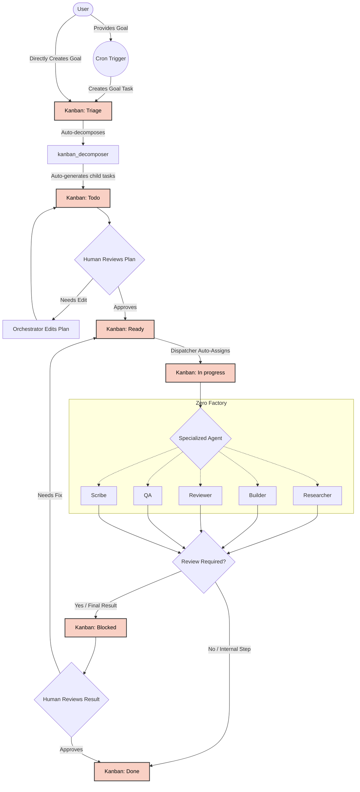

# Zero Factory

A 24/7 AI multi-agent orchestration system built on Hermes Agent. Six specialized agents form a complete software factory — from research to deployment.

## Core Principles

| Pillar | Description |
|--------|-------------|
| **24/7 Development** | Continuous iterations with frequent reprioritization, rolling handoffs, and parallel execution |
| **Productivity & Automation** | Multi-agent workflows that automate routine tasks end-to-end |
| **Quality & Reliability** | High-quality, maintainable, secure software with layered review |
| **Cost Efficiency** | Optimized token usage — each agent has only the skills it needs |
| **Hybrid Review** | AI-assisted review at every stage, with human-in-the-loop insight for important decisions |
| **Single Source of Truth** | One canonical location for shared info. Link, don't copy. |
| **Minimalist** | Everything as small, simple, clean, and usable as possible |

## Workflow

The workflow is based on the [Hermes Kanban](https://github.com/NousResearch/hermes-agent/blob/main/website/docs/user-guide/features/kanban.md) system.



## Quick Start

```bash
# 1. Clone the repo
git clone <repo-url> zerofactory
cd zerofactory

# 2. Link Hermes config
make hermes-link

# 3. Merge profile configurations
make merge-all

# 4. Launch an agent
hermes -p orchestrator -m "Research how to implement real-time notifications with WebSockets and PostgreSQL"

# 5. The Orchestrator delegates to Researcher, who produces a spec
#    then Builder implements, Reviewer checks quality, QA tests, Scribe documents
```

Full setup guide: [docs/setup-guide.md](docs/setup-guide.md)

## Profile Merge Steps

> [!TIP]
> Rule of thumb: only edit the custom source files (which are tracked by Git). The merged output files are listed in `.gitignore` and will be overwritten when you run the merge commands.

Any time you change a profile's custom files, you must rebuild the generated runtime files. You can merge everything at once or run individual merge commands:

```bash
# Merge config, jobs, SOUL, and link skills for all profiles
make merge-all
```

### Individual Merge Commands

**1. Config Merge**
You should only edit `config.custom.yaml`. Hermes reads `config.yaml` at runtime.
```bash
make config-merge
```

**2. Jobs Merge**
You should only edit `jobs.custom.json`. Hermes reads `jobs.json` for cron jobs.
```bash
make jobs-merge
```

**3. SOUL Merge**
You should only edit `SOUL.custom.md`. Hermes reads `SOUL.md` (which appends `common/SOUL.md`).
```bash
make soul-merge
```

**4. Skills Link**
Links common skills to all profiles.
```bash
make skills-link
```

## Orchestration & Team Structure

Zero Factory operates using a specialized team of Hermes agents (Orchestrator, Researcher, Builder, Reviewer, QA, Scribe) following an agile parallel pipeline.

The single source of truth for the team structure, pipeline architecture, and agent rules is defined in the [zerofactory-orchestration](profiles/common/skills/zerofactory-orchestration/SKILL.md) skill. Please refer to it for comprehensive details on how the factory operates.

## Project Structure

```
zerofactory/
├── Makefile              # Build & management shortcuts
├── README.md             # You are here
├── LICENSE
├── docs/                 # Documentation suite
│   ├── architecture.md   # System design and data flows
│   ├── api.md            # CLI interface and configuration reference
│   ├── setup-guide.md    # Installation and configuration
│   ├── troubleshooting.md # Common issues and solutions
│   ├── changelog.md      # Version history
│   └── runbook.md        # Operations runbook
├── profiles/         # Agent profiles
│   ├── common/       # Base config shared by all agents (source of truth)
│   │   ├── orchestrator/ # CEO — task decomposition & dispatch
│   │   ├── researcher/   # CTO — research & architecture
│   │   ├── builder/      # Lead Engineer — implementation
│   │   ├── reviewer/     # Code Reviewer — quality gates
│   │   ├── qa/           # QA — testing & verification
│   │   └── scribe/       # Documentation specialist
│   └── bin/              # Helper scripts (merge-config.sh)
```

## Documentation

Full documentation suite: [docs/](docs/)

|| Document | Description |
|----------|-------------|
| [README.md](README.md) | Project overview and quick start |
| [architecture.md](docs/architecture.md) | System design and data flows |
| [api.md](docs/api.md) | CLI interface and configuration reference |
| [setup-guide.md](docs/setup-guide.md) | Setup: hermes-link |
| [changelog.md](docs/changelog.md) | Version history and change log |
| [troubleshooting.md](docs/troubleshooting.md) | Common issues and solutions |
| [runbook.md](docs/runbook.md) | Operations runbook |

## Agent Configuration

### Toolsets by Profile

Toolsets and configuration constraints are defined in the [zerofactory-orchestration](profiles/common/skills/zerofactory-orchestration/SKILL.md) skill document. Please reference it for the canonical list of tools allowed per agent.

### Configuration Hierarchy

```
profiles/common/config.yaml    ← Base config (all agents share)
         ↓ + profile override
profiles/<profile>/config.custom.yaml  ← Profile-specific overrides
         ↓ merge-config.sh
profiles/<profile>/config.yaml  ← Merged final config
```

## Makefile Commands

| Command | Description |
|---------|-------------|
| `make hermes-link` | Link `~/.hermes/profiles/` only |
| `make config-merge` | Merge config for all profiles |
| `make skills-link` | Link common skills to all profiles |

## License

See [LICENSE](LICENSE).
