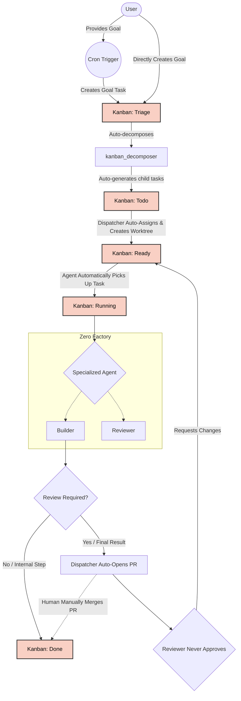

# Zero Factory

A 24/7 AI multi-agent orchestration system built on Hermes Agent. Six specialized agents form a complete software factory — from research to deployment.

## Core Principles

| Pillar | Description |
|--------|-------------|
| **24/7 Development** | Continuous iterations with frequent reprioritization, rolling handoffs, and parallel execution |
| **Productivity & Automation** | Multi-agent workflows that automate routine tasks end-to-end |
| **Quality & Reliability** | High-quality, maintainable, secure software with layered review |
| **Cost Efficiency** | Optimized token usage — each agent has only the skills it needs |
| **Hybrid Review** | AI-assisted review at every stage, with human-in-the-loop insight for important decisions |
| **Single Source of Truth** | One canonical location for shared info. Link, don't copy. |
| **Minimalist** | Everything as small, simple, clean, and usable as possible |
| **Living Documentation** | Always update the documentation in the same PR as the code changes. |

## The Team

Zero Factory operates using a specialized team of 4 AI agents, each with a distinct role, isolated toolset, and dedicated personality. By separating concerns, we ensure that agents don't get distracted by tasks outside their expertise, maximizing parallel efficiency and output quality.

| Agent & Configs | Role | Core Responsibilities |
| :--- | :--- | :--- |
| **Orchestrator**<br>[SOUL](profiles/orchestrator/SOUL.custom.md) \| [Config](profiles/orchestrator/config.custom.yaml) | Pipeline Overseer | Monitors the Kanban board, oversees the `kanban_decomposer` task breakdown, manages handoffs, and escalates blockers to the human. |
| **Builder**<br>[SOUL](profiles/builder/SOUL.custom.md) \| [Config](profiles/builder/config.custom.yaml) | Senior Software Engineer | Writes the code and tests. Focuses heavily on speed, type-safety, test coverage, and shipping features. |
| **Reviewer**<br>[SOUL](profiles/reviewer/SOUL.custom.md) \| [Config](profiles/reviewer/config.custom.yaml) | Quality Gatekeeper | Reviews PRs, checks for bugs, performance issues, security flaws, and verifies edge cases and tests. |

> **Note on modifications:** If you want to customize an agent's prompt (`SOUL.custom.md`), configuration or MCP servers (`config.custom.yaml`), or add custom skills, make your edits and then run `npm run sync` (or `npx hpm sync`) to regenerate the runtime configurations and links.

## Workflow & Architecture

The workflow is coordinated through the **Zero Factory Kanban** system ([`zerofactory-kanban`](./profiles/common/plugins/zerofactory-kanban/)), a dedicated, high-performance, and durable Kanban board plugin with a custom web dashboard UI designed specifically for Zero Factory lifecycle states and automated agent pipelines.



## Core Components

### 1. Agent Profiles & Configuration

The agent roles, toolsets, and configuration patterns are explicitly defined in the [zerofactory-orchestration](./profiles/common/skills/zerofactory-orchestration/SKILL.md) skill document. Please refer to it as the single source of truth for agent capabilities.

Zero Factory uses a multi-layered configuration approach:

- **Base config shared by all agents**: `profiles/common/config.yaml`
- **Profile-specific overrides**: `profiles/<profile>/config.custom.yaml`

For specific configurations, toolsets, dispatch logic, and agent parameters, please consult the actual configuration files and the skill document.

### 2. Zero Factory Kanban Board

Task coordination is powered by the custom **Zero Factory Kanban** plugin ([`zerofactory-kanban`](./profiles/common/plugins/zerofactory-kanban/)), providing a resilient, durable SQLite backend (`~/.hermes/zerofactory_kanban.db` with WAL mode) and a high-performance web dashboard.

- **Web Dashboard UI**: Embedded directly into the Hermes Agent Gateway at `/zerofactory-kanban` (e.g. `http://localhost:9119/zerofactory-kanban`), featuring drag-and-drop task movements, multi-board switching, priority filtering, task detail modals with activity feeds and comment threads.
- **Workflow Lifecycle States**:
  - **`Triage`** — Newly arrived goals and raw requests awaiting decomposition.
  - **`Todo`** — Granular sub-tasks ready for dispatching and worktree creation.
  - **`Ready`** — Approved tasks with all dependencies satisfied, queued for specialist pickup.
  - **`Running`** — Actively being executed by a specialist agent in an isolated Git worktree.
  - **`Blocked`** — Awaiting human review (e.g., active GitHub PR) or dependent on unfinished parent tasks.
  - **`Done`** — Completed and verified (PR merged).
- **Automated Dispatching Engine**: Built directly into `zerofactory-kanban`, automatically evaluating dependencies, enforcing WIP limits, assigning agents, provisioning isolated git worktrees, managing GitHub PRs, and routing reviewer feedback loops.
- **CLI Management**:
  ```bash
  hermes zerofactory-kanban list                  # View all tasks by column
  hermes zerofactory-kanban create "Task Title"   # Create a new ticket
  hermes zerofactory-kanban move <id> ready       # Move task across columns
  hermes zerofactory-kanban stats                 # View board health & throughput
  hermes zerofactory-kanban dispatch              # Trigger dispatcher evaluation pass
  ```
- **Legacy Migration**: Easily migrate legacy tasks from upstream Hermes Kanban (`~/.hermes/kanban.db`) using the web UI button or `POST /api/plugins/zerofactory-kanban/import-legacy`.

### 3. Automated Operations (Built-in Cron Engine)

Zero Factory periodic maintenance, health checks, and scanning are natively built directly into the **Zero Factory Kanban** plugin ([`profiles/common/plugins/zerofactory-kanban/builtin_cron.py`](./profiles/common/plugins/zerofactory-kanban/builtin_cron.py)).

Built-in jobs include:
- `zero-factory-task-queue-check` (every 120m): Checks for bottlenecked or stuck tasks and generates queue health reports.
- `zero-factory-daily-report` (`0 9 * * *`): Aggregates throughput, completions, and bottlenecks into a daily summary report.
- `zero-factory-improvement-scanner` (every 60m): Scans active board repositories for improvements and creates backlog tasks for the Builder.

The plugin automatically synchronizes these jobs into Hermes's cron registry on startup and schedules them in the background. You can inspect or trigger them anytime via CLI:
```bash
hermes zerofactory-kanban cron list
hermes zerofactory-kanban cron sync
hermes zerofactory-kanban cron run <job_id>
```


## Data Flow

1. **Goal Formulation**: User submits a goal via CLI (`hermes -p orchestrator -m "..."`)
2. **Auto-Triage**: Kanban decomposer breaks goal down into `Todo` tickets
3. **Execution Setup**: Kanban Dispatcher automatically assigns the `Todo` task, creates an isolated Git worktree, and promotes it to `Ready`
4. **Agent Pickup**: The assigned specialist agent automatically detects the task in `Ready` and moves it to `Running`
5. **Execution**: Specialists execute their tasks in `Running`
6. **PR Creation**: When an agent finishes, Kanban Dispatcher automatically pushes the branch, opens a GitHub PR, and hands it off to the Reviewer
7. **Continuous Polish**: The Reviewer acts as an improvement engine. It is instructed to iteratively find ways to refactor, optimize, and enhance the code. After a cap of 3 rounds, it will formally approve the PR to prevent over-engineering. The Dispatcher routes it back to the original author for fixes.
8. 🛑 **Human Merge**: The PR bounces between the author and Reviewer up to 3 times (taking advantage of free local compute) until it is approved for you to manually merge on GitHub.
9. **Completion**: The Kanban Dispatcher detects the `MERGED` state on GitHub and automatically marks the task as `Done`


## Communication Channels

| Channel | Purpose |
|---------|---------|
| Kanban Board | Task handoffs, status tracking, dependency management |
| File System | Shared output files, configuration, documentation |
| Gateway API | Real-time messaging between agents |

## Cost Optimization

| Technique | Setting | Purpose |
|-----------|---------|---------|
| Toolsets | Per-profile | Each agent has only the tools it needs |
| Compression | enabled, threshold 0.5 | Reduces context window usage |
| Prompt caching | cache_ttl: 5m | Reuses system prompt tokens |
| max_turns limits | Per profile (60-120) | Caps token consumption per task |
| Short-lived tasks | Task-based lifecycle | No idle agents burning resources |

## Agent Communication Protocol

Agents communicate through:
1. **Kanban board** — task status and handoffs
2. **Files** — shared output, configs, documentation
3. **Gateway** — real-time messaging

Each agent has a `description` field in its `config.custom.yaml` for quick identification by the Orchestrator.

## Task Lifecycle

### States

```
Triage → Todo → Ready → Running → Blocked → Done
```

### Task States Explained

| State | Description | Action |
|-------|-------------|--------|
| `Triage` | Initial goal received | Auto-decompose |
| `Todo` | Sub-tasks generated | Dispatcher assigns & configures worktree |
| `Ready` | Approved for work | Agent automatically picks up task |
| `Running` | Agent actively working | Monitor progress |
| `Blocked` | PR created / Waiting on human | Review PR / Unblock |
| `Done` | Task completed | Archive |

### Task Dependencies

Tasks can have parent-child relationships:
- Child tasks stay in `blocked` until **all** parents are `done`
- Use `--parent` flag when creating dependent tasks
- The Orchestrator manages dependency chains automatically

### Archiving

Old completed tasks can be archived:
```bash
hermes -p orchestrator -m "Archive all 'done' tasks from last month"
```

## Adding a New Project

Zero Factory automatically discovers and manages multiple projects. To add a new codebase to the factory:

1. Open the Hermes web UI and navigate to the **Zero Factory Kanban** board tab (`/zerofactory-kanban`) to create a new board (e.g., `zerohub`).
2. Add the remote Git URL of the repository into the **Description** field of the new board.
3. The `zero-factory-improvement-scanner` background cron job will automatically detect the new board, clone the repository into `~/git/` if it doesn't already exist, and begin scanning it for improvements.


## Setup Guide

- Linux machine (Raspberry Pi or x86_64)
- Python 3.11+
- Bun 1.1+
- sqlite3
- Hermes Agent installed

### 1. Clone and Setup

```bash
cd ~
git clone <repo-url> zerofactory
cd zerofactory
```

### 2. Link Hermes Profiles

Link profiles to the standard Hermes location:

```bash
make hermes-link
```

### 3. Merge Config & Link Plugins

After any edit to `profiles/<profile>/config.custom.yaml` (including MCP server changes), custom skills, or custom plugins, regenerate merged runtime files and links:

```bash
make merge-all
```

### 4. Running the Gateway

You only need to run the orchestrator gateway, because the cron jobs will schedule only on the running gateway:

```bash
hermes --profile orchestrator gateway run --replace
```

## Profile Management & Automation
 
Profile synchronization is powered by [`hermes-profile-manager`](https://github.com/hotcode-dev/hermes-profile-manager) (`hpm`), accessible via npm scripts or the `hpm` CLI.
 
| Action | Description | npm Script | CLI Command |
|--------|-------------|------------|-------------|
| **Sync All** | Merges configs, jobs, and SOUL, and links skills and plugins | `npm run sync` | `npx hpm sync` |
| **Config Merge** | Merges base config + profile overrides into runtime config | `npm run config-merge` | `npx hpm merge config` |
| **Jobs Merge** | Syncs cron jobs across profiles | `npm run jobs-merge` | `npx hpm merge jobs` |
| **SOUL Merge** | Merges SOUL files for each profile | `npm run soul-merge` | `npx hpm merge soul` |
| **Skills Link** | Links common skills to all profiles | `npm run skills-link` | `npx hpm link skills` |
| **Plugins Link** | Links common plugins to all profiles and `~/.hermes/plugins/` | `npm run plugins-link` | `npx hpm link plugins` |
| **Hermes Link** | Symlinks `profiles/` to `~/.hermes/profiles` so Hermes Agent reads them | `npm run hermes-link` | `npx hpm link hermes` |
| **Validate / Test** | Dry-run validation of profile merges and links | `npm test` | `npx hpm sync --dry-run` |
 
> **CRITICAL RULE FOR AI AGENTS:** NEVER FORGET TO RUN `npm run sync`! After ANY edit to ANY configuration file in the `profiles/` directory (including `config.custom.yaml`, `jobs.custom.json`, `SOUL.custom.md`, or custom skills/plugins), you MUST run `npm run sync` (or `npx hpm sync`) to regenerate all runtime configurations. Failure to do so will result in the active agent using stale, uncompiled prompts and configurations!

## License

See [LICENSE](LICENSE).
