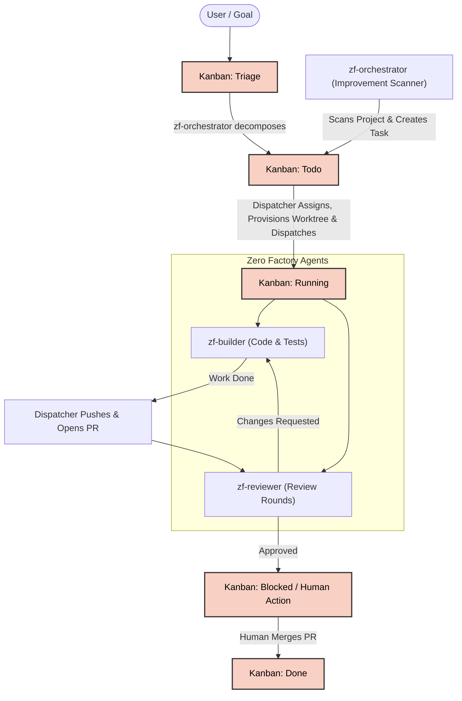

# Zero Factory

A 24/7 AI multi-agent orchestration system built as a native **Hermes Agent Plugin**. Three specialized agents form an autonomous software factory — from goal decomposition to implementation, testing, and continuous code review.



---

## Core Principles

| Pillar | Description |
|---|---|
| **24/7 Autonomous Factory** | Continuous agile iterations with rolling handoffs and parallel execution. |
| **Plugin-First Architecture** | Self-contained Hermes plugin with zero external Node.js or `hermes-profile-manager` dependencies. |
| **Isolated Profiles** | Profiles are cleanly namespaced (`zf-orchestrator`, `zf-builder`, `zf-reviewer`) in `~/.hermes/profiles/` and never clash with personal user profiles. |
| **Isolated Git Worktrees** | Every task runs in its own dedicated Git worktree (`~/git/<repo>-worktrees/<task_id>`). Agents never touch `main` directly. |
| **Thematic Continuous Review** | Layered code review capping at 3 focused rounds (Correctness → Performance → Refactoring) before handing off to human merge. |
| **Durable Kanban Storage** | Embedded SQLite backend with Write-Ahead Logging (`WAL` mode) and a glassmorphic web dashboard UI. |

---

## The Specialist Team

Zero Factory automatically provisions and maintains three specialized agent profiles:

| Profile | Role | Core Responsibilities |
|---|---|---|
| **`zf-orchestrator`** | Pipeline Overseer | Manages the Kanban board, oversees goal decomposition, manages handoffs, and escalates blockers to human review. |
| **`zf-builder`** | Senior Software Engineer | Writes clean code and tests, operates inside automated Git worktrees, and ships features rapidly. |
| **`zf-reviewer`** | Quality Gatekeeper | Conducts thematic, capped 3-round code reviews on GitHub Pull Requests, verifying test adequacy, performance, and architecture. |

---

## Quick Start & Installation

### 1. Install Plugin into Hermes
Install directly through Hermes plugin management:
```bash
hermes plugins install hotcode-dev/zerofactory
```
*(Alternatively, clone this repository directly into `~/.hermes/plugins/zerofactory`)*

### 2. Verify or Pre-Create Profiles
The plugin automatically bootstraps the required profiles on first run, inheriting your default LLM settings from `~/.hermes/config.yaml`. You can also manually inspect or create them anytime:
```bash
hermes zerofactory setup
```

### 3. Open the Kanban Dashboard
Start the Hermes Gateway or dashboard:
```bash
hermes dashboard
```
Open **`http://localhost:9119/zerofactory`** in your browser to view your boards, drag-and-drop tasks, and track agent progress.

---

## CLI Management

Zero Factory provides rich CLI commands under `hermes zerofactory`:

```bash
# Profile management
hermes zerofactory setup                          # Check or initialize zf-* profiles
hermes zerofactory sync-profiles                  # Update system prompts from plugin templates

# Task management
hermes zerofactory list                           # List all tasks
hermes zerofactory list --status running          # Filter tasks by status
hermes zerofactory list --assignee zf-builder     # Filter tasks by assignee
hermes zerofactory create "Implement Feature X"   # Create a new ticket
hermes zerofactory move <task_id> ready           # Transition task status
hermes zerofactory block <task_id> --reason "..." # Block a task
hermes zerofactory comment <task_id> "Note..."    # Post a comment to a ticket

# Board operations
hermes zerofactory board list                     # List all project boards
hermes zerofactory board create <git_url>         # Add a new codebase board from Remote Git URL
hermes zerofactory board delete <slug>            # Delete a board and clear its scanner job

# Dispatcher & Background Crons
hermes zerofactory dispatch                       # Trigger an immediate dispatch cycle
hermes zerofactory check-stuck                    # Audit long-running or hung worker processes
hermes zerofactory cron list                      # View active periodic health & scanner jobs
hermes zerofactory cron sync                      # Sync cron jobs with Hermes scheduler
hermes zerofactory cron run <job_id>              # Run a cron scanner immediately
```

---

## Task Lifecycle & Workflow

```text
       [Triage]
          │
          ▼
        [Todo]  ◄─────── (Changes Requested by Reviewer)
          │
   (Dispatcher provisions worktree & launches zf-builder)
          │
          ▼
       [Running] (zf-builder: Code & Tests)
          │
   (zf-builder finishes; Dispatcher creates GitHub PR)
          │
       [Running] (zf-reviewer: Multi-round Review)
          │
       Approved?
       ├── Yes ──► [Blocked] (Human Action: Review & Merge)
       │                         │
       │                  (Merged on GitHub)
       │                         │
       │                         ▼
       │                      [Done]
       │
       └── Changes Requested ──► [Todo] (Re-assigned to zf-builder)
```

1. **Goal Ingestion (`Triage`)**: Submit a high-level goal or feature request via CLI or web UI.
2. **Decomposition & Codebase Scanning (`Todo`)**: `zf-orchestrator` breaks `Triage` goals down into atomic sub-tasks, and runs periodic codebase scans to directly file actionable `Todo` improvement tasks for `zf-builder`.
3. **Autonomous Execution (`Running`)**: The dispatcher validates dependencies, provisions an isolated Git worktree, and launches `zf-builder` to write code and tests.
4. **PR Creation & Agent Review (`Running`)**: When `zf-builder` finishes, the dispatcher commits the branch, opens a GitHub Pull Request, and routes it to `zf-reviewer` in `Running` across 3 continuous review rounds (Correctness ➔ Performance ➔ Clean Code).
5. **Human Action & Merge (`Blocked`)**: Approved PRs move to `Blocked` awaiting human merge. Any crashed workers or merge conflict escalations also move to `Blocked` for operator review.
6. **Completion (`Done`)**: The human merges the PR on GitHub, and the dispatcher automatically marks the ticket as `Done` and prunes the worktree.

---

## Built-in Automation & Token-Efficient Cron Architecture

Zero Factory is architected to drastically minimize LLM token consumption (up to 95% token savings) across periodic automation cycles using Hermes Agent's **No-Agent Mode (`no_agent: true`)**, **Wake-Gate Change Detection (`{"wakeAgent": false}`)**, and **Chained LLM Jobs (`context_from`)**:

- **`zero-factory-task-queue-check`** (every 120m, **0 Tokens**):
  - Operates in Hermes **No-Agent Mode** via `scripts/zf_queue_watchdog.py`.
  - Audits running workers, reaps stuck subprocesses, and runs `run_dispatch_cycle()`.
  - When the queue is healthy, emits `{"wakeAgent": false}` to silently exit without invoking any LLM.
  - When bottlenecks occur, outputs a human-readable alert delivered to the operator.
- **`zero-factory-daily-report`** (`0 9 * * *`, **Single-Turn Synthesis**):
  - Pre-computes 24h velocity, cycle time, blockers, and column distributions via `scripts/zf_daily_stats.py`.
  - Automatically chains upstream output from `zero-factory-task-queue-check` via `context_from`.
  - Pre-loads all metrics directly into prompt context, eliminating 15+ tool queries and completing in a single turn.
- **`zero-factory-improvement-scanner-{board_slug}`** (on idle when active workers < 2, **0 Tokens on Idle**):
  - Executed by **`zf-orchestrator`** inside the repository workdir with wake-gate change detection via `scripts/zf_scanner_gate.py` with independent sessions (`continuity: false`).
  - Compares Git HEAD and working tree changes against `~/.hermes/scanner_state.json`.
  - Suppresses unchanged runs with `{"wakeAgent": false}` (0 LLM tokens).
  - When new commits or changes exist, pre-digests git log, diffstat, truncated diffs, and existing open board tasks, waking `zf-orchestrator` to analyze the project and file at most 1 actionable `Todo` task assigned to `zf-builder`.

---

## Repository Structure

```text
zerofactory/
├── plugin.yaml                  # Hermes plugin metadata
├── __init__.py                  # Plugin registration & CLI interface
├── dispatcher.py                # Autonomous dispatch engine & worktree manager
├── builtin_cron.py              # Periodic scanner & reporting engine
├── profile_manager.py           # Auto-provisioning for zf-* profiles & scripts
├── test_plugin.py               # Comprehensive unit & integration test suite (88 tests)
├── test_e2e.py                  # Hermetic End-to-End test suite across all subsystems (19 tests)
├── scripts/                     # No-Agent Mode scripts & LLM context pre-processors
│   ├── zf_queue_watchdog.py     # Autonomous worker reaper & queue monitor (0 tokens)
│   ├── zf_scanner_gate.py       # Codebase diff pre-screen & wake-gate
│   └── zf_daily_stats.py        # Deterministic 24h metrics & velocity calculator
├── dashboard/                   # Embedded web dashboard UI (/zerofactory)
│   ├── manifest.json            # Gateway route declaration
│   ├── plugin_api.py            # FastAPI REST backend
│   └── dist/
│       ├── index.js             # React Kanban UI
│       └── style.css            # Dark glassmorphic theme
├── skills/
│   └── zerofactory-orchestration/  # Multi-agent coordination skill
└── templates/                   # Version-controlled profile templates
    ├── zf-orchestrator/
    ├── zf-builder/
    └── zf-reviewer/
```

---

## Testing

Run the automated test suites against your local Hermes environment:
```bash
# 1. Run unit & integration test suite (88 tests)
python3 test_plugin.py

# 2. Run hermetic end-to-end (E2E) test suite (19 tests)
python3 test_e2e.py
```

---

## License

See [LICENSE](LICENSE).
