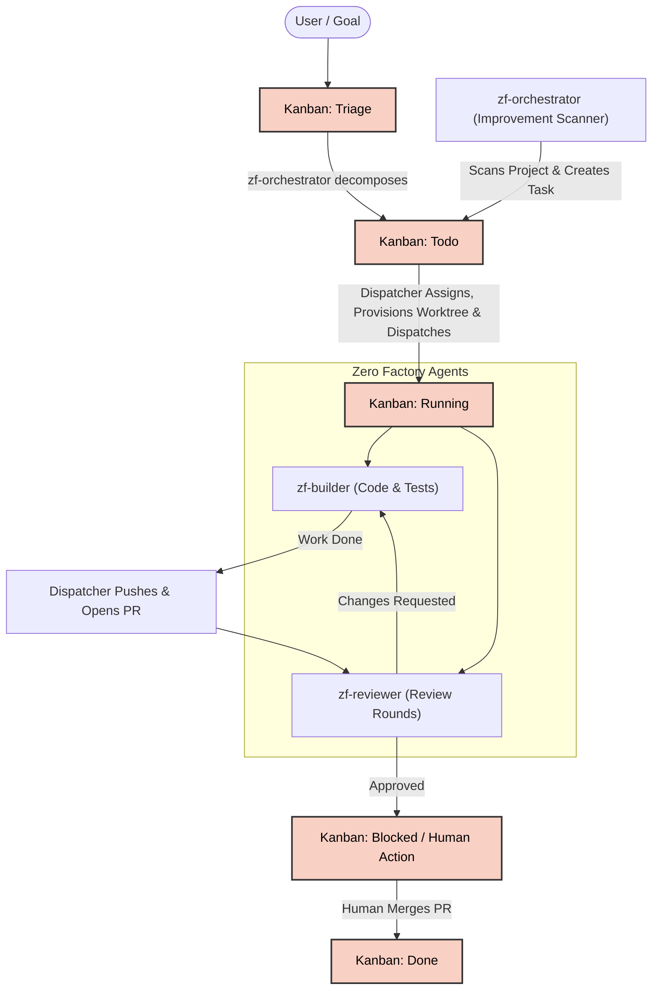

# Zero Factory

A 24/7 AI multi-agent orchestration system built as a native **Hermes Agent Plugin**. Three specialized agents form an autonomous software factory — from goal decomposition to implementation, testing, and continuous code review.

> [!WARNING]
> **Active Beta & High-Frequency Changes**  
> Zero Factory is currently in **active beta** and subject to **high-frequency changes**. APIs, CLI commands, agent prompt templates, and internal orchestration mechanics evolve rapidly. Please keep your installation up to date and check the repository regularly for updates.


```mermaid
graph TD
    classDef kanban fill:#f9d0c4,stroke:#333,stroke-width:2px,color:#000;
    
    User([User / Goal]) --> Triage[Kanban: Triage]:::kanban
    Triage -->|zf-orchestrator decomposes| Todo[Kanban: Todo]:::kanban
    Scanner["zf-orchestrator (Improvement Scanner)"] -->|Scans Project & Creates Task| Todo
    Todo -->|Dispatcher Assigns, Provisions Worktree & Dispatches| Running[Kanban: Running]:::kanban
    
    subgraph Zero Factory Agents
        Running --> Builder["zf-builder (Code & Tests)"]
        Running --> Reviewer["zf-reviewer (Review Rounds)"]
    end
    
    Builder -->|Work Done| PR[Dispatcher Pushes & Opens PR]
    PR --> Reviewer
    Reviewer -->|Changes Requested| Builder
    Reviewer -->|Approved| Blocked[Kanban: Blocked / Human Action]:::kanban
    Blocked -->|Human Merges PR| Done[Kanban: Done]:::kanban
```

> 📘 **Deep-dive reference**: every flow and its exact logic — deterministic engine and agentic workers — is documented step-by-step with Mermaid diagrams in [`docs/FLOWS.md`](docs/FLOWS.md).
> 🛠 **When something breaks**: follow the incident playbook in [`docs/DEBUGGING.md`](docs/DEBUGGING.md) — SQLite decision-trail queries, symptom-to-layer routing, and environment gotchas.

---

## Core Principles

| Pillar | Description |
|---|---|
| **24/7 Autonomous Factory** | Continuous agile iterations with rolling handoffs and parallel execution. |
| **Anti-Overengineering & Simplicity** | Built-in Ponytail philosophy ("Ladder of Laziness"): favors standard libraries, minimal surgical diffs, dead code elimination, and zero speculative bloat across all roles. |
| **Multi-Repository Project Workspaces** | Project boards link one or more equal Git repositories side-by-side with explicit board slugs, cross-service architecture prompts, and per-repository precommit/OpenWiki tooling. |
| **Plugin-First Architecture** | Self-contained Hermes plugin with zero external Node.js or `hermes-profile-manager` dependencies. |
| **Isolated Profiles** | Profiles are cleanly namespaced (`zf-orchestrator`, `zf-builder`, `zf-reviewer`) in `~/.hermes/profiles/` and never clash with personal user profiles. |
| **Isolated Git Worktrees** | Every task runs in its own dedicated Git worktree (`~/git/<repo_alias>-worktrees/<task_id>`). Sibling repositories on the board check out side-by-side. Agents never touch `main` directly. |
| **Thematic Continuous Review** | Layered code review capping at 2 focused rounds (Correctness & Tests → Verification & Polish) before handing off to human merge. |
| **Deterministic Precommit Gate** | Standardized format ➔ build ➔ test pipeline (`.zerofactory/precommit.sh`) ensuring zero broken builds or lint errors before PRs. |
| **OpenWiki Context Optimization** | Machine-readable architecture wiki (`openwiki/`) that slashes agent context bloat and exploratory tool calls by 30–40%. |
| **Durable Kanban Storage** | Embedded SQLite backend with Write-Ahead Logging (`WAL` mode) and a glassmorphic web dashboard UI. |

---

## The Specialist Team

Zero Factory automatically provisions and maintains three specialized agent profiles:

| Profile | Role | Core Responsibilities |
|---|---|---|
| **`zf-orchestrator`** | Pipeline Overseer | Manages the Kanban board, oversees goal decomposition, autonomously scans repositories for tech debt using the Ponytail ladder of laziness, and escalates blockers. |
| **`zf-builder`** | Senior Software Engineer | Writes clean code and tests using surgical, token-efficient diffs (Ponytail Ladder of Laziness), operates inside automated Git worktrees, and ships features rapidly. |
| **`zf-reviewer`** | Quality Gatekeeper | Conducts thematic code reviews on GitHub Pull Requests (Correctness & Tests → Verification & Polish, up to 2 rounds), verifying test adequacy, performance, and architecture. |

---

## Quick Start & Installation

### 1. Install Plugin into Hermes
Install directly through Hermes plugin management:
```bash
hermes plugins install hotcode-dev/zerofactory
```
*(Alternatively, clone this repository directly into `~/.hermes/plugins/zerofactory`)*

### 2. Verify or Pre-Create Profiles
The plugin automatically bootstraps the required profiles on first run, inheriting your default LLM settings from `~/.hermes/config.yaml`. You can also manually inspect or create them anytime:
```bash
hermes zerofactory setup
```

### 3. Open the Kanban Dashboard
Start the Hermes Gateway or dashboard:
```bash
hermes dashboard
```
Open **`http://localhost:9119/zerofactory`** in your browser to view your boards, drag-and-drop tasks, and track agent progress.

---

## CLI Management

Zero Factory provides rich CLI commands under `hermes zerofactory`:

```bash
# Profile management
hermes zerofactory setup                          # Check or initialize zf-* profiles
hermes zerofactory sync-profiles                  # Update system prompts from plugin templates

# Task management
hermes zerofactory list                           # List all tasks
hermes zerofactory list --status running          # Filter tasks by status
hermes zerofactory list --assignee zf-builder     # Filter tasks by assignee
hermes zerofactory create "Implement Feature X"   # Create a new ticket
hermes zerofactory create "Bug #42" --target-repos api,web # Create multi-repo triage task
hermes zerofactory split <task_id> [--repos api,web]       # Decompose multi-repo triage into Todo tasks
hermes zerofactory import-gh-issue 42             # Deterministically import GitHub issue #42
hermes zerofactory move <task_id> running          # Transition task status
hermes zerofactory block <task_id> --reason "..." # Block a task
hermes zerofactory comment <task_id> "Note..."    # Post a comment to a ticket

# Board operations
hermes zerofactory board list                                          # List all project boards
hermes zerofactory board create <git_url> [--slug <slug>] [--target-branch <branch>] [--architecture <arch>]   # Add a new board with optional custom slug & branch
hermes zerofactory board update <slug> [--target-branch <branch>] [--architecture <arch>]                       # Update board settings
hermes zerofactory board delete <slug>                                 # Delete a board and clear its scanner job
hermes zerofactory setup-repo --board <slug> [--repo <alias>]          # File P0 setup task to generate .zerofactory/precommit.sh
hermes zerofactory setup-openwiki --board <slug> [--repo <alias>]      # File P0 setup task to generate openwiki/ agent documentation

# Dispatcher & Background Crons
hermes zerofactory dispatch                       # Trigger an immediate dispatch cycle
hermes zerofactory check-stuck                    # Audit long-running or hung worker processes
hermes zerofactory cron list                      # View active periodic health & scanner jobs
hermes zerofactory cron sync                      # Sync cron jobs with Hermes scheduler
hermes zerofactory cron run <job_id>              # Run a cron scanner immediately
```

---

## Task Lifecycle & Workflow

```text
       [Triage]
          │
          ▼
        [Todo]  ◄─────── (Changes Requested by Reviewer)
          │
   (Dispatcher provisions worktree & launches zf-builder)
          │
          ▼
       [Running] (zf-builder: Code & Tests)
          │
   (zf-builder finishes; Dispatcher creates GitHub PR)
          │
       [Running] (zf-reviewer: Multi-round Review)
          │
       Approved?
       ├── Yes ──► [Blocked] (Human Action: Review & Merge)
       │                         │
       │                  (Merged on GitHub)
       │                         │
       │                         ▼
       │                      [Done]
       │
       └── Changes Requested ──► [Todo] (Re-assigned to zf-builder)
```

1. **Goal Ingestion (`Triage`)**: Submit a high-level goal or feature request via CLI or web UI.
2. **Decomposition & Codebase Scanning (`Todo`)**: `zf-orchestrator` breaks `Triage` goals down into atomic sub-tasks, and runs periodic codebase scans to directly file actionable `Todo` improvement tasks for `zf-builder`.
3. **Autonomous Execution (`Running`)**: The dispatcher validates dependencies, provisions an isolated Git worktree, and launches `zf-builder` to write code and tests.
   - **Global LLM capacity**: Settings → Global Max Concurrent LLM Workers caps running task agents and in-flight improvement scanners across all boards. For example, with a cap of 3, two running tasks on one board and one on another leave no slot for further tasks or scanners. The per-board running limits and Max Active Tasks (task WIP) apply independently. No-Agent queue checks do not consume LLM capacity.
4. **Deterministic Precommit & PR Creation (`Running`)**: When `zf-builder` finishes, the dispatcher executes `.zerofactory/precommit.sh` in the worktree (format ➔ build ➔ tests). Auto-formatted changes are staged, and if tests fail, the builder receives error logs to auto-fix (up to 3 retries). Once clean, the dispatcher commits, merges with latest main, pushes, opens a GitHub Pull Request, and routes it to `zf-reviewer` in `Running` for thematic review (Correctness & Tests ➔ Verification & Polish, up to 2 rounds).
5. **Human Action & Merge (`Blocked`)**: Approved PRs move to `Blocked` awaiting human merge. Any crashed workers or merge conflict escalations also move to `Blocked` for operator review.
6. **Completion (`Done`)**: The human merges the PR on GitHub, and the dispatcher automatically marks the ticket as `Done` and prunes the worktree.

---

## Session Lifecycle & Architecture

Zero Factory implements a **Session-per-Handoff (Stateless Workers, Stateful Substrate)** model rather than maintaining a single monolithic session per task or per agent.

### How Sessions Work Across Handoffs

1. **Initial Implementation (`zf-builder`)**:
   - The dispatcher provisions an isolated Git worktree and executes `hermes -p zf-builder --yolo --cli --accept-hooks chat -q <prompt>`.
   - Hermes initializes a dedicated session recorded in `~/.hermes/profiles/zf-builder/state.db` and tracked in task metadata (`metadata["sessions"]`).
2. **Review Handoff (`zf-reviewer`)**:
   - When implementation finishes, the dispatcher terminates the builder process (`SIGTERM`/`SIGKILL`), commits the branch, opens a GitHub Pull Request, and routes the ticket to `zf-reviewer`.
   - The dispatcher pre-digests the git diff and commit log in Python, then launches `hermes -p zf-reviewer ...`, creating a **brand new session** under `~/.hermes/profiles/zf-reviewer/state.db`.
3. **Changes Requested (`zf-reviewer` ➔ `zf-builder`)**:
   - When the reviewer requests changes on GitHub, the dispatcher imports comments into the SQLite `task_comments` table.
   - The reviewer worker is stopped, and the ticket routes back to `zf-builder`.
   - A **brand new session** is spawned for `zf-builder` with an injected prompt block (`🚨 CRITICAL: PULL REQUEST REVIEW COMMENTS TO ADDRESS`), allowing the builder to immediately address the feedback on the live worktree without the cognitive overhead of previous turns.

### Architectural Trade-offs: Session-per-Handoff vs. Single-Session-per-Agent-per-Task

| Dimension | **Zero Factory (Session per Handoff)** | **Single Session per Agent per Task (Resumed)** |
|---|---|---|
| **Context Window Size** | **Compact & predictable** (typically 3k–15k tokens per phase) | **Grows monotonically** (40k–100k+ tokens across review rounds) |
| **Token Cost per Review Round** | **Low & Flat** (starts clean with only review comments) | **Compounding** (re-reads entire implementation history on every turn) |
| **Context Drift & "Ghost Code"** | **Lowest** (Agent inspects current disk files in worktree) | **Higher** (Agent risks hallucinating code from early in-memory turns rather than disk) |
| **Fault Tolerance & Poisoned Loops** | **High** (Terminated workers discard bad hallucination loops) | **Lower** (Resumed session retains prior confusion or failed debugging traces) |
| **Reviewer Diff Clarity** | **High** (Reviewer receives clean, pre-digested current delta) | **Lower** (Reviewer history mixes original diff with updated diffs) |
| **Role & Profile Isolation** | **Strict** (Builder & Reviewer maintain isolated profiles, tools, and DBs) | **Strict** (Maintains role separation, but with accumulated history) |
| **Working Memory Continuity** | Persisted via **Native `kanban.db` Memory** (conventions, gotchas, decisions pre-digested into prompt) | ✅ Full conversation memory (remembers reasoning, discarded ideas, test nuances) |

### Stateless Workers, Stateful Substrate

Zero Factory intentionally externalizes durable state into **Git worktrees**, **GitHub PR review comments**, and **Kanban SQLite storage** instead of accumulating conversation memory. This guarantees deterministic handoffs, avoids token exhaustion, and eliminates "Lost in the Middle" attention degradation across iterative multi-round code reviews.

---

## Project Workspaces & Multi-Repository Architecture

Zero Factory models development around **Project Boards** that link one or more Git repositories side-by-side as equal first-class peers:

```text
Project Board: checkout-platform
├── Board Settings:
│   ├── Slug: checkout-platform (Custom user identifier)
│   ├── Architecture Notes: Cross-service contracts & interface boundaries
│   └── Max Concurrent Tasks: 2
└── Equal Linked Repositories:
    ├── backend (https://github.com/org/checkout-backend.git, target: main)
    │   ├── .zerofactory/precommit.sh (independent format/build/test)
    │   └── openwiki/ (independent architectural documentation)
    ├── frontend (https://github.com/org/checkout-web.git, target: main)
    │   ├── .zerofactory/precommit.sh
    │   └── openwiki/
    └── common-proto (https://github.com/org/common-proto.git, target: main)
        └── .zerofactory/precommit.sh
```

### Key Multi-Repository Capabilities
1. **Explicit Board Slugs**: Boards are identified by an explicit user-defined slug (`slug`), completely decoupled from any single repository's name.
2. **Equal Peer Repositories**: Every repository attached to a board has complete configuration parity:
   - Remote Git URL with live test-clone validation.
   - Independent target base branch (default `main`).
   - Dedicated trusted reviewers whose PR feedback routes to builder rework loops.
   - Independent `.zerofactory/precommit.sh` gate verification.
   - Independent `openwiki/` machine-readable documentation.
   - Independent GitHub Issue Templates & labels.
3. **Cross-Service Architecture & Contracts**:
   - The board's `architecture` field captures high-level interface definitions, inter-service contracts, and dependency graphs.
   - Automatically injected into all agent prompts (`## System Architecture & Inter-Service Contracts`) so workers understand boundaries before modifying code.
4. **Side-by-Side Worktree Isolation**:
   - Tasks target a specific repository (`repo_alias`).
   - The dispatcher provisions the task worktree at `~/git/<repo_alias>-worktrees/<task_id>` while ensuring sibling repositories on the board are checked out side-by-side for cross-service inspection.

---

## Native `kanban.db` Memory & Agents Dashboard

Zero Factory features **Native `kanban.db` Memory** — a durable, local SQLite repository knowledge substrate that allows specialist agents and developers to persist conventions, gotchas, architecture decisions, and rejected paths scoped per board.

### Why Native `kanban.db` Memory?
1. **Zero External Infrastructure**: Stored directly in `kanban.db` via SQLite table `board_memories` with cascading cleanup on board deletion.
2. **Deterministic Pre-Digest**: Automatically pre-digested by `dispatcher.py` into spawned worker prompts (`zf-builder`, `zf-reviewer`, `zf-orchestrator`), ensuring agents never repeat past mistakes or violate repository conventions.
3. **Structured Taxonomy**:
   - `convention`: Coding rules, file formats, test execution expectations.
   - `gotcha`: Concurrency pitfalls, fragile mocks, subtle edge cases.
   - `decision`: Architectural and design choices that govern future work.
   - `rejected_path`: Approaches that were tried and discarded, preventing wasteful re-attempts.
   - `general`: General repository knowledge.

### Integrated "Agents" Dashboard
The dashboard navigation tab has evolved from `AI Sessions` to **`Agents`**:
- **3 Specialist Agent Cards**: Real-time status (`🟢 Active` vs `⚪ Idle`), live execution activity, active session model & duration, and direct links to active Kanban tasks.
- **Sub-Tab Switcher**: Seamlessly switch between `💬 AI Sessions` (full execution history & chat resume links) and `🧠 Repository Memory` (knowledge cards with search, category filtering, and modal CRUD).

### Memory CLI Commands
```bash
# List repository memories for a board
hermes zerofactory memory list --board <slug> [--category <cat>] [-q <query>]

# Record a new repository memory
hermes zerofactory memory add --board <slug> "<content>" --category convention --tags "test,lint"

# Delete a memory
hermes zerofactory memory delete <memory_id>
```

### Automated Memory Recording & Disable Controls
Zero Factory automatically captures repository insights during developer and agent workflows:
- **Automated Extraction**: When `zf-reviewer` leaves PR comments, a task is moved to `blocked` with a review reason, or comments are posted to a task, lines prefixed with:
  `GOTCHA:`, `CONVENTION:`, `RULE:`, `DECISION:`, `ARCH:`, `REJECTED_PATH:`, `LESSON:`, `LEARNING:`, or `TIP:`
  are automatically extracted, tagged (`auto-recorded`, `from-<actor>`), deduplicated, and persisted to `board_memories`.
- **Noise Protection**: Arbitrary comments and routine approvals are deliberately excluded to prevent prompt pollution and keep repository context high-signal.
- **Multi-Level Controls to Disable**:
  1. **Global Setting**: Settings Modal toggle (`Auto-record repository memory`) or `PATCH /api/plugins/zerofactory/settings`.
  2. **Per-Board Override**: Board Edit modal checkbox, or the 1-click `⚡ Auto-Record: ON/OFF` button in the `Agents` -> `Repository Memory` sub-tab header, or `PATCH /api/plugins/zerofactory/boards/<slug>`.

---

## Built-in Automation & Token-Efficient Cron Architecture

Zero Factory is architected to drastically minimize LLM token consumption (up to 95% token savings) across periodic automation cycles using Hermes Agent's **No-Agent Mode (`no_agent: true`)**, **Wake-Gate Change Detection (`{"wakeAgent": false}`)**, and **Chained LLM Jobs (`context_from`)**:

- **`zero-factory-task-queue-check`** (every 120m, **0 Tokens - No-Agent Mode**):
  - Operates in Hermes **No-Agent Mode** via `scripts/zf_queue_watchdog.py`.
  - Runs purely in Python (consuming 0 LLM tokens). Audits running workers, reaps stuck subprocesses, and triggers `run_dispatch_cycle()`.
  - When the queue is healthy, emits `{"wakeAgent": false}` to silently exit without invoking any LLM.
  - When bottlenecks occur, outputs a human-readable alert delivered to the operator.
- **`zero-factory-improvement-scanner-{board_slug}`** (on idle when active workers < 2, **0 Tokens when Busy / Cooldown**):
  - Exactly **1 cron job per board**, executed by **`zf-orchestrator`** with wake-gate change detection via `scripts/zf_scanner_gate.py` (`continuity: false`).
  - Evaluates all peer repositories on the board in a single pass. If all repositories are unchanged, or if the board is busy (`running >= 2` or `todo >= 2`) or in cooldown, suppresses execution with `{"wakeAgent": false}` (0 LLM tokens).
  - When updates exist (or on capacity-driven idle round-robin), wakes `zf-orchestrator` targeting the selected repository with pre-digested git context, diffstat, code markers, and instructions to file at most 1 actionable `Todo` task (`--board <slug> --repo <alias>`).
- **`zero-factory-openwiki-update-{board_slug}`** (daily, **0 Tokens - No-Agent Mode**):
  - Exactly **1 cron job per board** via `scripts/zf_openwiki_gate.py`.
  - Synchronizes OpenWiki workspace links (`~/.openwiki/wiki-workspaces.json`) across all sibling repositories on the board and evaluates commit drift against `openwiki/` documentation across all board repositories in a single pass.
  - If documentation is current or update tasks are already active, suppresses with `{"wakeAgent": false}` (0 LLM tokens).
  - When non-doc code changes accumulate on any linked repository, automatically files a deterministic `todo` documentation refresh task on the board for `zf-builder`.

---

## Deterministic Precommit Pipeline (`.zerofactory/precommit.sh`)

Zero Factory enforces a strict, deterministic precommit quality gate for every task before git commits are authored or pull requests are opened. Rather than relying on speculative agent checks, the dispatcher executes `.zerofactory/precommit.sh` directly inside the task's isolated Git worktree:

```bash
.zerofactory/precommit.sh [all|format|build|test|install-hook]
```

### The 3-Phase Verification Sequence

1. **`format` (Format & Lint)**:
   - Enforces repository-wide code formatting and deterministic lint fixing (e.g., `ruff check --fix .` and `ruff format .` for Python, `prettier`/`eslint` for JS/TS, `gofmt` for Go, `cargo fmt` for Rust).
   - **Self-bootstrapping**: If required linter binaries are missing from the environment, the script automatically installs them to the system (e.g., via `uv tool install ruff@latest` or `pip3 install --user ruff`). The test phase likewise auto-installs the pinned test stack (pytest + plugin runtime deps) and never falls back to `unittest` discovery — the suite is pytest-based.
   - Any auto-formatted files are staged automatically by the dispatcher.
2. **`build` (Static Compilation & Typecheck)**:
   - Validates that all sources compile cleanly with zero syntax or packaging errors (e.g., `python3 -m compileall`, `tsc --noEmit`, `cargo check`, `go build ./...`).
3. **`test` (Automated Test Execution)**:
   - Runs the hermetic project test suite (e.g., `python3 -m pytest tests/ -q`).

### Self-Healing Retry Loop
If `.zerofactory/precommit.sh` encounters syntax errors or failing unit tests, the dispatcher does **not** abandon the task or open a broken PR. Instead, it captures the exact terminal stdout/stderr failure output and re-spawns `zf-builder` in an automated self-healing feedback loop (up to 3 retries) to fix regressions before proceeding to code review.

### Setting Up Precommit for a Board
- **Web Dashboard**: When viewing a board where repositories lack `.zerofactory/precommit.sh`, warning banners and per-repo cards in the Edit Board modal provide a 1-click **⚡ Setup Repo for Zero Factory** action for each repository.
- **CLI**:
  ```bash
  hermes zerofactory setup-repo --board <slug> [--repo <alias>]
  ```
  This creates a `P0` ticket assigned to `zf-builder` targeting the specified repository (or the default repository if `--repo` is omitted) to inspect the project layout, auto-detect language tooling, and generate an executable `.zerofactory/precommit.sh`.

---

## OpenWiki Context Optimization (`openwiki/`)

To keep multi-agent software development token-efficient and prevent context degradation, Zero Factory integrates the **OpenWiki** architecture pattern:

```text
<repository_root>/
├── AGENTS.md                  # High-level entrypoint pointing agents to openwiki/
└── openwiki/
    ├── index.md               # Master system index & navigational architectural map
    ├── architecture.md        # Subsystem contracts, entrypoints & data flows
    ├── components/            # Detailed module specifications & API schemas
    └── conventions.md         # Repository patterns, error paradigms & test rules
```

### Why OpenWiki for Agent Workflows?
- **30–40% Token Reduction**: Eliminates wasteful exploratory tool calls (repetitive `grep_search`, `list_dir`, and trial-and-error source file reads). Agents read `openwiki/index.md` first to locate exact modules and contracts.
- **Context Window Hygiene**: Prevents loading hundreds of lines of implementation code into LLM prompts when only architectural contracts and APIs are required.
- **Multi-Agent Alignment**: Ensures `zf-builder`, `zf-reviewer`, and `zf-orchestrator` share a uniform understanding of the codebase structure, naming conventions, and cross-module boundaries.

### Setting Up OpenWiki for a Board
- **Web Dashboard**: For any repository on a board without `openwiki/`, recommendation banners and per-repo cards in the Edit Board modal offer 1-click **📖 Setup OpenWiki** triggers for each repository.
- **CLI**:
  ```bash
  hermes zerofactory setup-openwiki --board <slug> [--repo <alias>]
  ```
  This dispatches a `P0` setup ticket targeting the repository directing `zf-builder` to run the OpenWiki MCP lifecycle, generate the architectural taxonomy, create module specs, and link them directly into `AGENTS.md`.

### Native MCP Architecture (Zero API Keys or ENV Setup)

Rather than running an external standalone CLI that requires duplicate LLM API keys and manual `export` configurations, Zero Factory integrates OpenWiki as a **native Model Context Protocol (MCP) server**:

- **Pre-configured in `zf-builder` and `zf-reviewer` (`config.yaml`)**:
  ```yaml
  mcp_servers:
    openwiki:
      command: npx
      args:
        - -y
        - openwiki
        - mcp
        - --host=hermes
      enabled: true
  ```
- **Zero Configuration**: OpenWiki runs locally over stdio as a deterministic queue, Claims validator, and manifest generator. Hermes provides the model intelligence, so **zero external LLM API keys or environment variables (`OPENWIKI_PROVIDER`, `OPENAI_API_KEY`) are needed**.
- **10 Native MCP Tools Available**:
  - `openwiki_begin`: Detects repository git diff & staleness; no-ops if already current.
  - `openwiki_submit_plan`: Submits the canonical page taxonomy and seed paths.
  - `openwiki_next_page` / `openwiki_submit_page`: Iteratively assigns and writes pages, validating OKF frontmatter and registering SHA256 hashes in `.page-manifest.json`.
  - `openwiki_finish`: Finalizes the run, stamps `.last-update.json`, and links `AGENTS.md`.
  - `openwiki_search` / `openwiki_read`: Fast, model-free architectural retrieval for agents mid-task.
- **Skill Bundling**: The official OpenWiki skill is provided at `skills/openwiki/SKILL.md` and automatically synced into `~/.hermes/skills/` on `hermes zerofactory setup`.

### OpenWiki Workspaces (`~/.openwiki/wiki-workspaces.json`) & Multi-Repo Linking

For multi-repository boards, Zero Factory automatically links sibling repositories into an OpenWiki Workspace (`id={board_slug}`):
- **Cross-Service Querying**: When `zf-builder` works on a feature in one repository, it can invoke `openwiki_search` to query data models, API schemas, and architecture specifications documented across all sibling repositories on that board without needing multiple open sessions.
- **Automated Synchronization**: Every board creation, update, and gate check automatically synchronizes `~/.openwiki/wiki-workspaces.json` (`version: 1`), registering member wikis and setting the active workspace context so agents always have seamless cross-service visibility.

---

## Repository Structure

```text
zerofactory/
├── plugin.yaml                  # Hermes plugin metadata
├── __init__.py                  # Plugin registration & CLI interface
├── dispatcher/                  # Autonomous dispatch engine & worktree manager
├── cron/                        # Periodic scanner & reporting engine
├── profile_manager.py           # Auto-provisioning for zf-* profiles & scripts
├── tests/                       # Modular test suite (unit, integration, e2e)
│   ├── unit/                    # Unit tests for paths, settings, scripts, cron, dispatcher, etc.
│   ├── integration/             # FastAPI dashboard REST API route integration tests
│   └── e2e/                     # Hermetic end-to-end workflow & resilience tests (20 tests)
├── scripts/                     # No-Agent Mode scripts & LLM context pre-processors
│   ├── zf_queue_watchdog.py     # Autonomous worker reaper & queue monitor (0 tokens)
│   ├── zf_scanner_gate.py       # Codebase diff pre-screen & wake-gate
│   └── zf_daily_stats.py        # Deterministic 24h metrics & velocity calculator
├── dashboard/                   # Embedded web dashboard UI (/zerofactory)
│   ├── manifest.json            # Gateway route declaration
│   ├── plugin_api.py            # FastAPI REST backend
│   ├── build_css.mjs            # Regenerates dist/style.css (Tailwind v4, portable)
│   ├── input.css                # Tailwind entry source (bare package imports)
│   └── dist/
│       ├── index.js             # React Kanban UI
│       └── style.css            # Dark glassmorphic theme (committed build output)
├── skills/
│   ├── zerofactory-orchestration/  # Multi-agent coordination skill
│   ├── ponytail/                   # Canonical Ladder of Laziness (LADDER.md)
│   ├── zf-builder-ponytail/        # Code authoring playbook (surgical diffs, stdlib-first)
│   ├── zf-orchestrator-ponytail/   # Codebase audit playbook (dead code & tech debt scan)
│   └── zf-reviewer-ponytail/       # PR gatekeeping playbook (diff bloat & dependency veto)
└── templates/                   # Version-controlled profile templates
    ├── zf-orchestrator/
    ├── zf-builder/
    └── zf-reviewer/
```

---

## Testing

Run the automated test suites using `pytest`:
```bash
# 1. Run all test suites
pytest tests/

# 2. Run specific test tiers
pytest tests/unit/
pytest tests/integration/
pytest tests/e2e/
```

### Rebuilding the dashboard stylesheet

The committed `dashboard/dist/style.css` is generated from `dashboard/input.css`
by `dashboard/build_css.mjs` (Tailwind CSS v4). It is portable — no machine-
specific paths — resolving `tailwindcss` from the project's `node_modules` or
the `ZEROFACTORY_TAILWIND_DIR` env override. To regenerate after editing the UI:
```bash
npm install            # if node_modules is not present (fresh clone)
node dashboard/build_css.mjs
```
`tests/unit/dashboard/test_dashboard_css.py` guards reproducibility and asserts
the stylesheet carries selectors for every variant-prefixed class the UI references
(hover/focus/active/disabled).

---

## License

See [LICENSE](LICENSE).

<!-- OPENWIKI:START -->

## OpenWiki

This repository has a generated `openwiki/` evidence index. It is optional just-in-time context, not required startup reading.

- Do not enumerate, preload, or search wikis at task start. Use retrieval when the user asks for it, when unfamiliar architecture or dependency behavior materially affects the task, or when source inspection leaves an important uncertainty. Stop once the question is grounded.
- When those conditions apply and OpenWiki retrieval tools are available, use `openwiki_search` for just-in-time context and `openwiki_read` for the relevant complete sections. If search returns `workspace_required`, ask which listed workspace to use and retry with its ID.
- Use `openwiki_list_workspaces` or `openwiki_list_wikis` when workspace membership itself needs to be discovered.
- If the retrieval tools are unavailable, read `openwiki/quickstart.md` and follow its links to the relevant pages.
- Treat source code and tests as authoritative. A brief's unknowns and review items are verification gaps, not automatic requirements.
- Prefer the narrowest quiet validation that proves the changed behavior. Preserve complete failure output.

The scheduled OpenWiki GitHub Actions workflow refreshes the repository wiki. Do not hand-edit generated OpenWiki pages unless explicitly asked; prefer updating source code/docs and letting OpenWiki regenerate.

<!-- OPENWIKI:END -->
