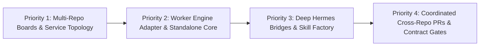

# Zero Factory — Strategic Product Roadmap

A 24/7 AI multi-agent orchestration system for autonomous software development.



---

## ✅ Priority 1 (Implemented): Multi-Repository Boards & System Architecture

### Problem Statement
Real-world production architectures are rarely isolated single-repository monoliths. When teams operate microservices (e.g. shared libraries, API gateways, backend services, event consumers), an AI agent working in one repository is blind to:
- Downstream breaking changes caused by API or schema modifications.
- Upstream client contracts and payload formats.
- Shared dependencies and version bump requirements.
- Message queue schemas, broker bindings, and inter-service HTTP routes.

### Objectives & Deliverables

#### 1. Multi-Repository Association per Board
- Extended the Kanban board data model to support multiple linked repositories per board.
- Relational entity `board_repositories`:
  - `board_slug`: Foreign key to board.
  - `repo_alias`: Unique identifier within the board (e.g. `common-lib`, `api-gateway`, `order-service`, `event-worker`).
  - `git_url`: Remote Git repository URL or local path.
  - `target_branch`: Target base branch (e.g. `main` or `develop`).
  - `role`: Service classification (`library`, `gateway`, `service`, `worker`, `docs`).
  - `is_primary`: Flag denoting default repo for new board tasks.

#### 2. Flat Side-by-Side Task Workspace Layout
- **Single Primary Repo per Task:** Each task targets one primary repository for git commits, precommit checks, and pull requests (`1 task = 1 branch = 1 PR`).
- **Side-by-Side Sibling Checkouts:**
  ```text
  ~/git/zerofactory-worktrees/task-102/
  ├── order-service/        <-- Primary target repo (writable worktree, branch task/102)
  ├── common-lib/           <-- Sibling repo (read-only clean detached checkout of main)
  ├── api-gateway/          <-- Sibling repo (read-only clean detached checkout of main)
  └── notification-worker/  <-- Sibling repo (read-only clean detached checkout of main)
  ```
- **Execution Environment:**
  - `TERMINAL_CWD` starts inside `./order-service/`.
  - Natural relative path navigation (`../common-lib`) supports standard monorepo/microservice tooling (`go.work`, npm `file:../common-lib`, Docker Compose contexts) without synthetic directory wrappers.

#### 3. System Architecture & Relation Notes (`architecture`)
- Persisted on each board as `boards.architecture`.
- Hybrid format: **YAML frontmatter** for machine-readable dependency edges and communication protocols + **Markdown body** for architecture notes, conventions, and gotchas.
- Example representation:
  ```markdown
  ---
  dependencies:
    api-gateway: [common-lib, order-service]
    order-service: [common-lib]
    notification-worker: [common-lib]
  communication:
    api-gateway -> order-service: HTTP REST (port 8080)
    order-service -> notification-worker: SQS queue "order-events"
  ---

  ### Microservice Notes & Contracts
  - **common-lib**: Shared protobufs and DTOs. Bump `package.json` minor version on interface changes.
  - **order-service**: Emits `OrderCreated` events defined in `common-lib/events/order.proto`.
  - **api-gateway**: Proxies client requests; contracts located in `specs/swagger.json`.
  ```

#### 4. Sequential Task Chaining & Rich Context Injection
- Support both **Hard Blocking (`blocks`)** and **Soft Peer Relations (`relates_to`)**:
  - Example Sequential Flow:
    - `Task 1: [common-lib] Add refund event schema` ➔ **Blocks** Task 2 & Task 3
    - `Task 2: [order-service] Emit refund event` ➔ **Blocked by** Task 1, **Relates to** Task 3
    - `Task 3: [api-gateway] Expose POST /refund endpoint` ➔ **Blocked by** Task 1, **Relates to** Task 2
- **Dispatcher Auto-Unblock:** When Task 1's PR is merged (`done`), the Dispatcher automatically transitions Task 2 and Task 3 from `blocked` to `todo`. `relates_to` tasks are non-blocking.
- **Rich Context Injection in `ContextBuilder`:**
  - When Task 2 runs, the dispatcher automatically injects:
    1. **Completed Parent Context:** Task 1's title, PR URL, and completion status.
    2. **Peer Task Context:** Task 3's title, target repo, and status so Task 2 aligns with parallel service work.
    3. **System Architecture:** Relevant inter-service edges and architecture notes from `boards.architecture`.
    4. **Sibling Repositories:** Sibling paths (`../<alias>/`), branches, and roles available for read-only inspection.

#### 5. Hybrid Task Chain Creation & Decomposition
- Tasks specify `repo_alias`.
- `zf-orchestrator` and humans can define task dependencies and assign target repositories.

---

## ⚡ Priority 2: Standalone Core & Pluggable Worker Engine

### Objectives & Deliverables

#### 1. Pluggable Worker Engine Adapter (`AgentWorker` Interface)
- Decouple the ZeroFactory Dispatcher from hardcoded `hermes` CLI subprocess calls:
  - `HermesWorker`: Default worker executing through Hermes profiles (`zf-builder`, `zf-reviewer`).
  - `PiWorker`: Headless execution using Mario Zechner's minimalist `pi-coding-agent` (`pi-mono`).
  - `ClaudeCodeWorker` / `NativeWorker`: CLI wrappers for alternative coding agent runtimes.
- Abstract process tracking, log tailing, and cancellation behind a uniform contract.

#### 2. Standalone Python Server & Web Packaging
- Provide a native CLI entry point (`zerofactory serve` / `zerofactory start`).
- Host a standalone FastAPI server that directly serves the REST API and the pre-built React Vite dashboard (`dashboard/dist`) on `http://localhost:9119`.
- Migrate configuration and state paths from `~/.hermes/` to `~/.zerofactory/` with automatic backward compatibility for existing Hermes installations.

---

## 🤖 Priority 3: Deep Hermes Superpowers (Hermes-Native Mode)

When running inside the Hermes ecosystem, maximize Hermes' built-in platform capabilities:

#### 1. Multi-Channel Human-in-the-Loop (Telegram / Slack / Discord)
- Route Kanban tasks blocked on human intervention (`blocked: human-gate`, Grill Interview questions) directly to chat apps via Hermes messaging bridges.
- Allow human developers to reply directly in Telegram/Slack to unblock tasks or approve PR merges without needing to open the web dashboard.

#### 2. Autonomous Skill Factory (`agentskills.io`)
- When `zf-builder` solves complex repo-specific problems (e.g. specialized mock environments, database migrations), Hermes automatically extracts reusable skills into `~/.hermes/skills/`.
- Future tasks across all boards and repositories immediately inherit the discovered procedures.

#### 3. In-Flight Language Server Protocol (LSP) Diagnostics
- Integrate Hermes' native LSP engine into the editing loop.
- Validate compiler diagnostics, imports, and types *while editing*, catching regressions before reaching the precommit gate.

#### 4. Native Subagent Task Orchestration
- Migrate from detached OS subprocess spawning (`subprocess.Popen`) to native Hermes subagent task delegation, enabling structured return types, real-time streaming tokens, and native cancellation.

---

## 🏢 Priority 4: Advanced Cross-Repo Coordination & Enterprise Quality Gates

#### 1. Coordinated Cross-Repo Pull Requests
- When a feature spans a shared library and consumer service, the builder provisions worktrees across both repositories and coordinates atomic or sequential PRs.
- Reviewer agents cross-validate integration tests between the paired pull requests.

#### 2. Microservice Contract Testing Gate
- Integrate automated contract testing (Pact, OpenAPI diff validation, Protobuf compatibility checks) into `.zerofactory/precommit.sh` prior to PR creation.
