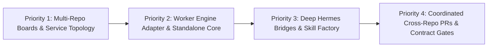

# Zero Factory — Strategic Product Roadmap

A 24/7 AI multi-agent orchestration system for autonomous software development.



---

## 🎯 Priority 1 (Immediate Epic): Multi-Repository Boards & System Topology

### Problem Statement
Real-world production architectures are rarely isolated single-repository monoliths. When teams operate microservices (e.g. shared libraries, API gateways, backend services, event consumers), an AI agent working in one repository is blind to:
- Downstream breaking changes caused by API or schema modifications.
- Upstream client contracts and payload formats.
- Shared dependencies and version bump requirements.
- Message queue schemas, broker bindings, and inter-service HTTP routes.

### Objectives & Deliverables

#### 1. Multi-Repository Association per Board
- Extend the Kanban board data model from a single `git_url` to support multiple linked repositories per board.
- New relational entity: `board_repositories`:
  - `board_slug`: Foreign key to board.
  - `repo_alias`: Unique identifier within the board (e.g. `common-lib`, `api-gateway`, `order-service`, `event-worker`).
  - `git_url`: Remote Git repository URL.
  - `default_branch`: Target base branch (e.g. `main` or `develop`).
  - `role`: Service classification (`library`, `gateway`, `service`, `worker`, `docs`).
  - `local_cache_path`: Cloned reference directory.

#### 2. System Topology & Relation Notes (`system_topology`)
- Store a machine-readable architecture and dependency graph per board in YAML/Markdown.
- Example representation:
  ```yaml
  architecture:
    type: microservices
    repositories:
      common-lib:
        role: library
        description: "Shared domain models, DTOs, and RPC clients."
      api-gateway:
        role: gateway
        depends_on: [common-lib]
        calls:
          - target: order-service
            protocol: http_rest
            contract_path: api-gateway/specs/orders.swagger.json
            notes: "Proxies checkout and order placement with JWT auth."
      order-service:
        role: backend_service
        depends_on: [common-lib]
        emits:
          - queue: orders.events
            broker: aws_sqs
            schema: common-lib/events/order_created.proto
            consumed_by: [event-worker]
      event-worker:
        role: queue_consumer
        depends_on: [common-lib]
        consumes:
          - queue: orders.events
            handler: src/consumers/order_event.ts
  ```

#### 3. Automatic Prompt Context Digest (`ContextBuilder`)
- Automatically compile a `### System Architecture & Microservice Topology` block into the context of `zf-orchestrator`, `zf-builder`, and `zf-reviewer`.
- Gives the LLM full visibility into:
  - Upstream dependencies and downstream consumers.
  - Where contracts and shared schemas live.
  - Breaking-change risks across the service boundary.
- Allows read-only inspection of related repo code/specs when working on a primary task.

#### 4. LLM Topology Assistant ("Relation Note Generator")
- Allow `zf-orchestrator` to automatically scan repos (inspecting `package.json`, `go.mod`, `docker-compose.yml`, protobufs, or OpenAPI specs) to auto-generate and maintain the relational architecture graph.

---

## ⚡ Priority 2: Standalone Core & Pluggable Worker Engine

### Objectives & Deliverables

#### 1. Pluggable Worker Engine Adapter (`AgentWorker` Interface)
- Decouple the ZeroFactory Dispatcher from hardcoded `hermes` CLI subprocess calls:
  - `HermesWorker`: Default worker executing through Hermes profiles (`zf-builder`, `zf-reviewer`).
  - `PiWorker`: Headless execution using Mario Zechner's minimalist `pi-coding-agent` (`pi-mono`).
  - `ClaudeCodeWorker` / `NativeWorker`: CLI wrappers for alternative coding agent runtimes.
- Abstract process tracking, log tailing, and cancellation behind a uniform contract.

#### 2. Standalone Python Server & Web Packaging
- Provide a native CLI entry point (`zerofactory serve` / `zerofactory start`).
- Host a standalone FastAPI server that directly serves the REST API and the pre-built React Vite dashboard (`dashboard/dist`) on `http://localhost:9119`.
- Migrate configuration and state paths from `~/.hermes/` to `~/.zerofactory/` with automatic backward compatibility for existing Hermes installations.

---

## 🤖 Priority 3: Deep Hermes Superpowers (Hermes-Native Mode)

When running inside the Hermes ecosystem, maximize Hermes' built-in platform capabilities:

#### 1. Multi-Channel Human-in-the-Loop (Telegram / Slack / Discord)
- Route Kanban tasks blocked on human intervention (`blocked: human-gate`, Grill Interview questions) directly to chat apps via Hermes messaging bridges.
- Allow human developers to reply directly in Telegram/Slack to unblock tasks or approve PR merges without needing to open the web dashboard.

#### 2. Autonomous Skill Factory (`agentskills.io`)
- When `zf-builder` solves complex repo-specific problems (e.g. specialized mock environments, database migrations), Hermes automatically extracts reusable skills into `~/.hermes/skills/`.
- Future tasks across all boards and repositories immediately inherit the discovered procedures.

#### 3. In-Flight Language Server Protocol (LSP) Diagnostics
- Integrate Hermes' native LSP engine into the editing loop.
- Validate compiler diagnostics, imports, and types *while editing*, catching regressions before reaching the precommit gate.

#### 4. Native Subagent Task Orchestration
- Migrate from detached OS subprocess spawning (`subprocess.Popen`) to native Hermes subagent task delegation, enabling structured return types, real-time streaming tokens, and native cancellation.

---

## 🏢 Priority 4: Advanced Cross-Repo Coordination & Enterprise Quality Gates

#### 1. Coordinated Cross-Repo Pull Requests
- When a feature spans a shared library and consumer service, the builder provisions worktrees across both repositories and coordinates atomic or sequential PRs.
- Reviewer agents cross-validate integration tests between the paired pull requests.

#### 2. Microservice Contract Testing Gate
- Integrate automated contract testing (Pact, OpenAPI diff validation, Protobuf compatibility checks) into `.zerofactory/precommit.sh` prior to PR creation.
