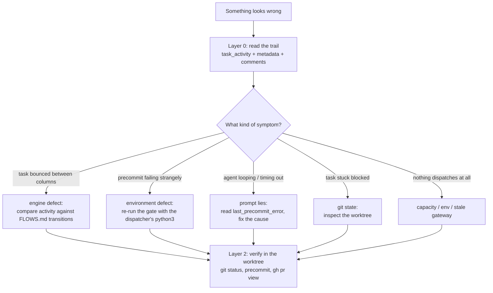

# Zero Factory — Debugging & Incident Playbook

> How to investigate when something goes wrong in the factory. Works for humans and for
> `zf-builder`/`zf-orchestrator` sessions asked to diagnose a stuck or failing task.
> Companion to [`FLOWS.md`](FLOWS.md) (how things *should* work) — this is how to find
> out why they didn't.

---

## 1. Three-layer triage

Start cheap: **read the decision trail first** (Layer 0, ~30 seconds, pure SQLite), route the
symptom to a layer (Layer 1), and only then verify physically in the worktree (Layer 2).



---

## 2. Layer 0 — the decision trail (SQLite)

Every dispatcher decision is written down. The kanban DB is `~/.hermes/zerofactory.db`
(`ZEROFACTORY_DB` overrides):

```bash
DB="${ZEROFACTORY_DB:-$HOME/.hermes/zerofactory.db}"

# What does the board believe right now? (status, assignee, pointers, flags)
sqlite3 -readonly "$DB" "SELECT status, assignee, workspace_path, pr_url, metadata
                        FROM tasks WHERE id='<task_id>';"

# What did the dispatcher do, in order? (the full decision log)
sqlite3 -readonly "$DB" "SELECT datetime(created_at,'unixepoch'), actor, action, details
                        FROM task_activity WHERE task_id='<task_id>' ORDER BY id;"

# What did it tell the humans? (precommit output, review notes, blockers)
sqlite3 -readonly "$DB" "SELECT datetime(created_at,'unixepoch'), author, substr(body,1,300)
                        FROM task_comments WHERE task_id='<task_id>' ORDER BY id DESC LIMIT 10;"
```

Reading the `metadata` blob is the fastest "why" check:

| Key | Tells you |
|---|---|
| `blocked_reason` | the human-readable cause the dispatcher recorded |
| `last_precommit_error` | the gate's captured output (truncated) — what the builder was asked to fix |
| `last_worker_failure` | worker crash/timeout detail (retcode, reason, time) |
| `precommit_retries` / `worker_failure_retries` / `conflict_retries` | which budget is exhausted, and how much is left |
| `sessions[]` | every LLM handoff: agent, PID, start/end, outcome (`finished`/`aborted`/`timed_out`/`failed`) |
| `awaiting_pr` / `close_pr` / `packaged_by` | pending system intent (see FLOWS.md §2.2) |
| `spawning_at` | claim-time spawn-in-flight marker (Unix epoch). The reaper refuses to orphan-recover a `running` task within `ZEROFACTORY_SPAWN_GRACE_SECONDS` (default 180s) of this stamp — the window where `worker_pid`/`sessions[]` are not yet written. |

---

## 2b. Layer 0.5 — the STEP timeline (`~/.hermes/logs/agent.log`)

The SQLite trail records *decisions*; the log records *steps*. Every dispatcher
pipeline step emits a paired, grep-able marker so the log reconstructs where a
task spent its time:

```bash
grep "STEP" ~/.hermes/logs/agent.log | grep 'task=<task_id>'
```

| Marker | Meaning |
|---|---|
| `STEP <name> start \| task=<id> \| <detail>` | step entered |
| `STEP <name> end \| task=<id> \| <outcome> \| <duration>s \| <detail>` | step finished (`ok` / `fail` / `error` / `skip`) |
| `STEP <name> \| task=<id> \| <state> \| <detail>` | recurring gate decision (rate-limited) |

Step names map to the packaging pipeline and friends: `worktree.setup`,
`worker.spawn`, `package.precheck`, `package.precommit`, `package.commit`,
`package.merge`, `package.push`, `package.pr`, `package.route_reviewer`,
`done.cleanup`, `move`, `pr_poll`, `package`, `dispatch`, `dispatch_cycle`.

Rules of thumb:

- **A `start` with no matching `end`** = the process died mid-step (crash, OOM,
  external kill). The last `start` names the step to inspect.
- **`end` with `fail`/`error`** = the step ran and rejected the work; the
  `detail` column carries the reason (exit code, conflict files, timeout).
- **`STEP <name> \| ... \| skip \| ...`** lines are *recurring gate* decisions
  (the 30s poll loop re-evaluates the same gates every cycle). They are
  rate-limited: the first occurrence logs, repeats are suppressed for 15
  minutes, and any state/detail *change* logs immediately. A task parked in a
  bad state therefore leaves exactly one breadcrumb — e.g. the `package` step's
  `skip | no candidate (assignee=human, status=running, pr=True, awaiting_pr=True)`
  is the smoking gun from the zf-hdz-4dc03cee stall, where every selector
  matched but no actor owned the task.

> ⚠️ **Timestamps**: `agent.log` timestamps are *local time*; `task_activity`
> `created_at` values are Unix epoch (UTC). Convert before correlating:
> `sqlite3 ... "SELECT datetime(created_at,'unixepoch'), ..."` prints UTC.

---

## 3. Symptom → layer routing

| Symptom | Layer | First move |
|---|---|---|
| Task bounces between columns (e.g. `done` → `todo`) | engine (state machine) | Compare `task_activity` actions against FLOWS.md §3/§9 — the illegal transition is always one of the step-3 routes; `done` must never be left except via `awaiting_pr` packaging |
| Repeated "precommit failed" with weird, **unfixable** output (import errors, missing modules) | environment | Re-run `bash .zerofactory/precommit.sh` with the gate's interpreter (see §5) |
| `ImportError`/collection errors in the full suite that pass when a test runs alone | environment | Check `tests/conftest.py`'s `import tests` pin against `~/.hermes/hermes-agent` `tests/` shadowing (§5) |
| Builder times out in a loop (2× 3600s) | agentic flailing | The worker is trying to fix something not fixable from the worktree — read `last_precommit_error`, fix the cause, then `move` the task to reset retry counters |
| Task stuck `blocked` with conflicts | git | In the worktree: `git status`, `grep -rn '<<<<<<<' --include='*.py'`, `ls .git/MERGE_HEAD` |
| Task parked with **no** activity rows for hours | engine (silent gate) | `grep "STEP" agent.log \| grep <task_id>` — the last `skip`/`start` line names the gate or step that dropped it (§2b) |
| Task bounced out of `blocked`/`done` by an agent report | engine (stale worker) | Look for `move_rejected` in `task_activity` — the guard now ignores zombie `move done` on parked states (only `changes-requested` accepts builder completion). If the row exists, the clobber was rejected as designed. |
| PR merged/closed on GitHub, board not updated | polling lag (by design) | `gh pr view` vs the task row; the next cycle's `MERGED`/`CLOSED` branch archives it |
| Nothing dispatches at all | capacity / env | `hermes zerofactory check-stuck`, board `max_concurrent_running`, `ZEROFACTORY_*` env, gateway restart |
| Badges/UI look wrong | UI derivation | Badges derive from `status`/`assignee`/`metadata` only — if one shows stale state, the bug is in the derivation, never in titles |

---

## 4. Layer 2 — verify physically (don't trust the DB alone)

```bash
cd ~/git/<repo>-worktrees/<task_id>   # the worktree is ground truth for code state
git status --porcelain && git log --oneline -5
bash .zerofactory/precommit.sh        # reproduce the gate exactly as the dispatcher runs it
gh pr view task/<task_id> --json state,reviewDecision,mergeable
```

- The **worktree diff** (`git diff` against the target branch) tells you what the agent
  actually did — faster than reading session transcripts.
- Conflict markers left in files are visible with the grep above; `MERGE_HEAD` present means
  a half-finished merge.
- For agent behavior, the dashboard **Agents → AI Sessions** tab has transcripts and resume
  links (`metadata.sessions[]` holds the PIDs/session ids to look for).

---

## 5. Environment gotchas (hard-won)

1. **The gate runs on a different Python than your shell.** The dispatcher spawns
   `.zerofactory/precommit.sh` with bare `python3` from the hermes runtime PATH —
   the tool Python 3.14 (`~/.hermes/tools/python-3.14*/bin`), which does **not** carry
   your dev packages. The gate self-bootstraps its pinned test stack (pytest, fastapi,
   httpx, pydantic, PyYAML) — if it can't, it fails with an actionable hint.
   To reproduce gate failures exactly:
   ```bash
   PATH="$HOME/.hermes/tools/python-3.14"*"/bin:$PATH" bash .zerofactory/precommit.sh
   ```
2. **`tests/` package shadowing.** Importing `dispatcher` inserts `~/.hermes/hermes-agent`
   and `~/git/hotcode-dev` into `sys.path`; hermes-agent ships its own `tests/` (and `cron/`)
   packages. `tests/conftest.py` pins the real `tests` package in `sys.modules` — keep that
   pin if you touch conftest.
3. **Stale gateway modules.** The dispatcher/API run inside the long-lived gateway process;
   code changes need a gateway restart (`hermes gateway restart`) before they take effect.
   The CLI warns about this ("Gateways may still be serving pre-update modules").
4. **Polling lag is normal.** GitHub-side changes (merge, close, comments) are picked up by
   the 30s dispatch cycle — a few cycles of delay is expected, not a bug.
5. **Retry budgets are small by design** (`3` for precommit / worker / conflict,
   `2` review rounds per commit). A task that exhausts one moves to `blocked` — that is the
   system asking for a human, not a hang.

---

## 6. Rules of thumb (each earned by a real incident)

1. **Suspect the environment before the code.** Gate/precommit failures are more often the
   interpreter than the product.
2. **If an agent loops, the prompt is lying.** Long timeouts mean it was asked to fix
   something unfixable from its sandbox. Fix the cause, then move the task to reset budgets.
3. **State lives in columns/metadata only.** If routing logic parses a title or comment,
   that's a bug — the invariant is "titles are state-free".
4. **`done` is terminal** unless `awaiting_pr` is set. Any other transition out of `done` is
   a defect by definition.
5. **One writer per state.** Status transitions go through `/move` only; metadata flags are
   written and consumed by the dispatcher. If you add a second writer, you've found the bug
   of the future.
6. **Record what you learn.** `hermes zerofactory memory add --board <slug> "GOTCHA: …"`
   feeds the memory digest every worker prompt receives — that's how fixes stick.

---

## 7. Tooling reference

| Tool | Use |
|---|---|
| `hermes zerofactory list --status blocked` | what needs human attention now |
| `hermes zerofactory check-stuck` | audit long-running / hung workers |
| `hermes zerofactory comment <id> "…"` | leave findings on the card for the next agent |
| `hermes zerofactory move <id> todo` | revive a task (resets worker failure bookkeeping) |
| `hermes zerofactory memory add\|list\|delete` | repository knowledge (GOTCHA/CONVENTION/…) |
| dashboard **Agents** tab | live worker status, session transcripts, resume links |
| dashboard **Activity/Cron** tabs | decision timeline, cron health (`wakeAgent` gating) |
| `docs/FLOWS.md` | the authoritative "how it should work" reference |
