# Zero Factory — Complete Flow & Logic Reference

> Step-by-step reference for **every flow in the system**, split by nature:
> **Deterministic** (Python, no LLM, always runs) vs **Agentic** (LLM workers, invoked per handoff).
> Complements [`AGENTS.md`](../AGENTS.md) (overview) — this document is the precise logic reference.
> When something deviates from these flows, use the [`DEBUGGING.md`](DEBUGGING.md) incident playbook.

---

## 1. Architecture at a Glance

Zero Factory is a two-layer system. A **deterministic engine** owns all state, git, and process
management; **agentic workers** are stateless one-shot LLM sessions that only read a prompt,
edit the worktree, and report back via CLI.

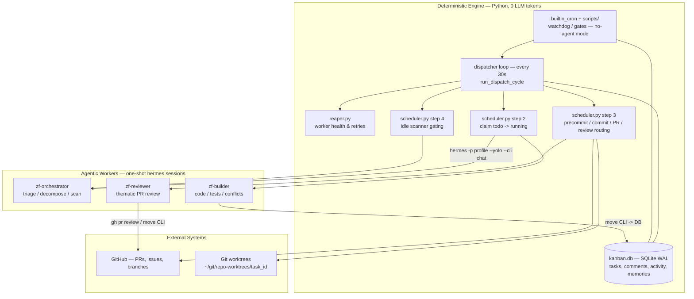

**Invariants**

| # | Invariant | Enforced by |
|---|---|---|
| 1 | Agents never run `git add/commit/push` — the dispatcher packages all work | worker prompts + dispatcher step 3 |
| 2 | `main` is never touched by agents — every task runs in `~/git/<repo>-worktrees/<task_id>` | `worktree.setup_worktree` |
| 3 | A PR is only created after the deterministic precommit gate passes | `worktree.run_deterministic_precommit` |
| 4 | `done` is strictly terminal — packaging runs while the task is `running` (`awaiting_pr`) | scheduler terminal-done guard |
| 5 | Exactly one status reply is posted to a source GitHub issue, only at PR-open time | `scheduler.post_issue_pr_comment` |
| 6 | Nothing runs unbounded: worker timeout 3600s, retries capped, review rounds capped | reaper + `_handle_precommit_failure` + review cap |

---

## 2. Task Model

### 2.1 Statuses (Kanban columns)

| Status | Meaning | Who moves tasks here |
|---|---|---|
| `triage` | Goal/issue awaiting decomposition or human interview | importer, orchestrator, human |
| `todo` | Atomic, actionable, ready to claim | orchestrator, human, dispatcher (review reroute / unblock) |
| `running` | Worker active **or** dispatcher packaging (`awaiting_pr`) | dispatcher (atomic claim, packaging phase) |
| `blocked` | **Human gate only**: awaiting merge, review cap, exhausted budgets, unverifiable state | reviewer, dispatcher (budgets exhausted), human |
| `done` | Completed — **strictly terminal** | dispatcher (MERGED/CLOSED/no-diff), human, orchestrator |

### 2.2 Metadata flags & counters

| Key | Set by | Meaning |
|---|---|---|
| `awaiting_pr` | reaper (worker exit 0), `move_task` by agents | Builder work finished; the task stays `running` while the dispatcher packages → PR → reviewer |
| `close_pr` | `move_task` by humans when `pr_url` exists | Human closed task; dispatcher must archive the PR + remote branch |
| `issue_pr_comment_posted` | dispatcher after issue reply | Source-issue reply already sent (extra dedup guard) |
| `packaged_by` | dispatcher at PR packaging | Assignee that authored the packaged PR (review reroute target) |
| `external_issue` | issue importer | `{source: github\|jira, id, key, repo_or_project, has_ai_request, url}` |
| `worker_pid`, `session_id`, `started_at` | worker spawner | Active worker bookkeeping |
| `sessions[]` | worker spawner / reaper | Per-handoff session log (`ongoing` → `finished`/`aborted`/`timed_out`/`failed`) |
| `worker_failure_retries`, `last_worker_failure` | reaper | Crash/timeout retry budget (`DEFAULT_MAX_WORKER_RETRIES = 3`) |
| `precommit_retries`, `last_precommit_error` | `_handle_precommit_failure` | Precommit gate retry budget (max 3) |
| `conflict_retries` | conflict handlers | Merge-conflict retry budget (`ZEROFACTORY_MAX_CONFLICT_RETRIES = 3`) |
| `processed_review_comment_ids`, `last_reviewed_commit`, `commit_review_count`, `review_cap_reached` | step-3 review routing | Review-round bookkeeping, per commit SHA |
| `permanently_blocked`, `blocked_reason` | reaper / dispatcher | Hard-stop marker + human-readable cause (display only) |
| `blocked_reason_type` | `move_task` (from `block --reason <code>`), dispatcher | Canonical routing code — `changes-requested` / `approved` / `human-gate`, matched exactly, never prose |
| `awaiting_interview`, `last_interview_reply` | orchestrator grill flow | Human interview state |

### 2.3 Titles are state-free

Task titles never carry mutable lifecycle state — UI badges derive from structured fields:
"waiting for merge" = `status=blocked && assignee=human`, "merge conflict" =
`metadata.conflict_retries` present, PR author = `metadata.packaged_by`. Two immutable labels
survive by convention: `[Triage]` (set once at issue import) and the `[AI:<profile>]`
attribution prefix on GitHub PR titles/bodies (`ai_prefix`).

### 2.4 State machine

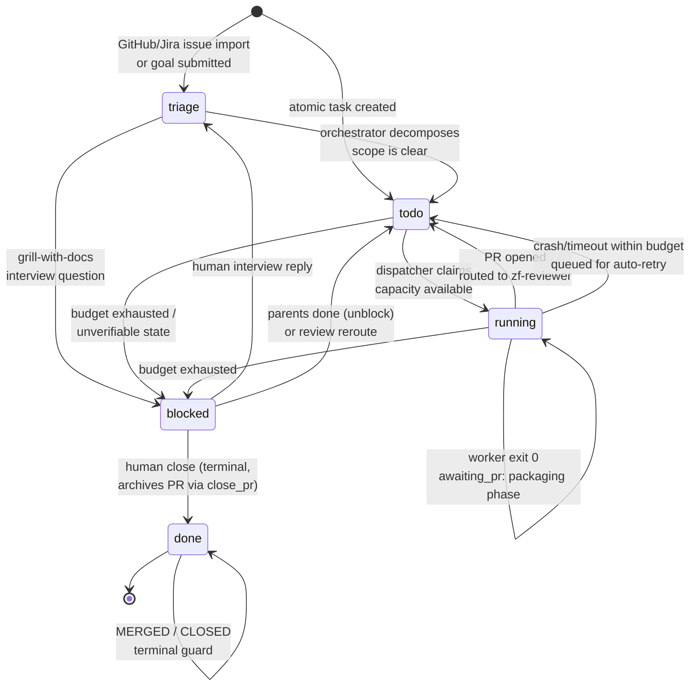

---

## 3. The Deterministic Dispatch Cycle

Runs every `DISPATCH_INTERVAL_SECONDS = 30` in the gateway background thread
(`_dispatcher_loop`) and on demand (API `move`, watchdog cron). A cross-process file lock makes
concurrent cycles skip safely.

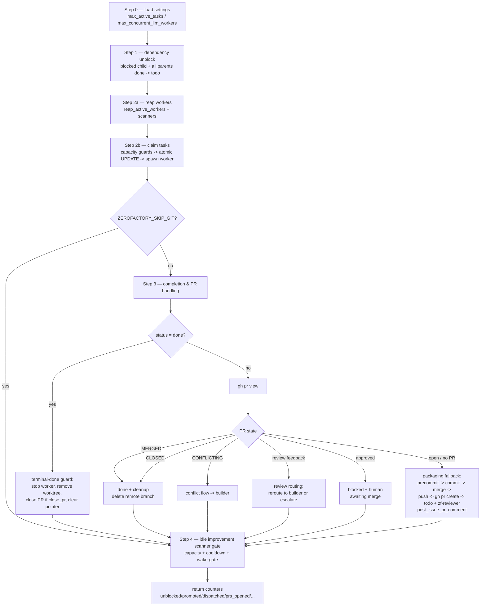

### Step 1 — Dependency unblock
`task_links` DAG: any `blocked` task whose parents are **all** `done` becomes `todo`
(activity `unblock`).

### Step 2 — Reap, then claim
- **Reap** first (see §4). Then select claim candidates:
  `status = 'todo' OR (status='triage' AND assignee='zf-orchestrator')`,
  ordered by priority (`P0`→`P3`) then age.
- **Capacity guards** (all must pass): global `max_active_tasks`, global
  `max_concurrent_llm_workers` (counts running tasks + active scanners + in-flight LLM cron jobs),
  per-board `max_concurrent_running` (default 1).
- **Pre-flight (git boards)**: `check_unresolved_conflicts_safe` + `pull_and_merge_main` —
  conflicts route the task to the conflict handler **before** any worker burns tokens
  (fail-closed: unverifiable state → skip claim).
- **Atomic claim**: `UPDATE ... WHERE id=? AND status IN ('todo',...)` — zero rowcount
  means another cycle won the race; skip. On success, write session metadata and spawn the worker.

### Step 3 — Completion & PR handling
Polls tasks matching: `pr_url` set and not `done`, OR `blocked` with a builder assignee, OR
`running` + `awaiting_pr` (packaging phase), OR `done` with leftovers (`workspace_path` / `close_pr`). Per task:

1. **Terminal-done guard** — `done` is strictly terminal: stop worker, remove
   worktree, if `close_pr` → `gh pr close <pr_url>` + delete remote branch + `manual_done`
   activity, clear `workspace_path`, `continue`. Never commit/push/PR/reroute again.
2. **PR poll** (`gh pr view --json reviewDecision,state,url,mergeable,headRefOid`):
   - `MERGED` / `CLOSED` → stop worker, remove worktree, delete remote branch,
     status `done`.
   - `CONFLICTING` → conflict resolution flow (unless a builder already resolved and is
     handing off — then fall through to packaging).
   - **`changes-requested` verdict (`blocked_reason_type`) or `reviewDecision == CHANGES_REQUESTED`** → record comments (memory
     auto-extraction runs here), bump `commit_review_count` (reset when the head SHA changes),
     remove worktree, route back to builder: `todo` + `assignee=<PR author>` + review-comment
     prompt block. When `commit_review_count > ZEROFACTORY_MAX_REVIEW_ROUNDS` (default **2**)
     → escalate: `blocked` + `assignee=human` + `review_cap_reached`.
   - **`approved` verdict or `reviewDecision == APPROVED`** → `blocked` +
     `assignee=human` ("Reviewer approved; awaiting human merge").
3. **Packaging fallback** (no PR yet, or `done`/`blocked` handoff): deterministic
   **precommit gate** (§6) → conflict checks → commit (conventional message) → merge latest
   target branch → push `task/<id>` → `gh pr create` (body carries `Fixes #N` / Jira link) →
   `todo` + `assignee=zf-reviewer` + `metadata.packaged_by` → worktree removed →
   **issue reply** (§10). No diff vs base ("No commits between") → `done` directly.

### Step 4 — Idle improvement scanner gate
Spawns the per-board improvement scanner only when the board has spare capacity
(`running < max`, `todo < idle_scan_max_todo`), past a 15-minute cooldown, and LLM capacity
remains. Otherwise the cron wake-gate suppresses it at 0 token cost (§11).

---

## 4. Worker Lifecycle (deterministic supervision of agentic runs)

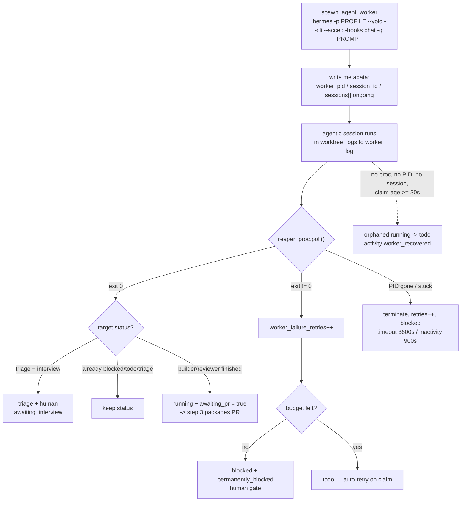

- Spawn command: `hermes -p {zf-builder|zf-reviewer|zf-orchestrator} --yolo --cli --accept-hooks chat -q <prompt>`
  with `HERMES_KANBAN_WORKSPACE`, `TERMINAL_CWD`, `HERMES_PROFILE`, `HERMES_HOME=~/.hermes/profiles/
`.
- Stuck detection: `running > 3600s` (`ZEROFACTORY_TASK_TIMEOUT_SECONDS`) **or**
  `running > 900s && no log activity > 900s` (`DEFAULT_INACTIVITY_TIMEOUT_SECONDS`).
- Retry budget: `DEFAULT_MAX_WORKER_RETRIES = 3` per task, then `permanently_blocked` (human only).

---

## 5. Prompt Assembly per Handoff (Session-per-Handoff)

Each handoff spawns a **brand-new** session; durable state lives in git, the PR, and the DB.
Common blocks on every prompt: task header (id/title/priority/description/workspace/branch) +
**repository memory digest** (`digest_board_memories_context`, §12).

| Handoff | Profile | Injected blocks | Terminal action expected |
|---|---|---|---|
| Initial implementation | `zf-builder` | goal instructions (implement, test, verify) | `hermes zerofactory move <id> done` |
| Conflict resolution | `zf-builder` | conflicted file list + resolution rules | `move <id> done` |
| Precommit self-heal | `zf-builder` | 🚨 precommit failure output + reproduce/fix loop | `move <id> done` |
| Changes requested | `zf-builder` | 🚨 PR review comments block (pre-digested) | `move <id> blocked --reason "review-required"` |
| Thematic review | `zf-reviewer` | pre-digested git context (commits, diffstat, truncated diff) | `block <id> --reason "approved"` or `--reason "changes-requested"` |
| Triage / scan | `zf-orchestrator` | task comments, OpenWiki hints, scanner pre-digest | decomposition via task create / `move` to `todo` |

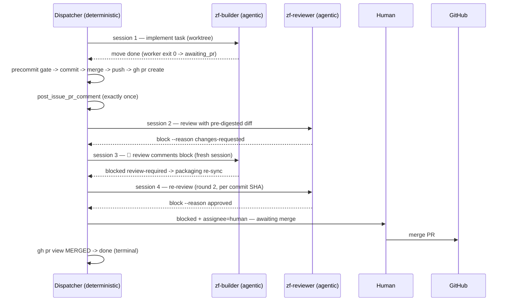

---

## 6. Deterministic Precommit Gate (`.zerofactory/precommit.sh`)

Runs inside the worktree **before any commit or PR** (`run_deterministic_precommit`,
timeout `ZEROFACTORY_PRECOMMIT_TIMEOUT_SECONDS = 300`).

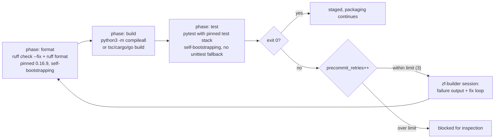

- **Self-bootstrapping**: missing `ruff` or the pinned test stack (`pytest==9.0.3`,
  `fastapi==0.133.1`, `httpx==0.28.1`, `pydantic==2.13.4`, `PyYAML==6.0.3`) is auto-installed
  (`uv pip install --python python3` / `pip install --user`). If installation is impossible the
  gate exits non-zero with an actionable hint — it **never** degrades to `unittest discover`
  (the suite is pytest-based; fallback produced bogus collection errors).
- Setup for a new board: dashboard banner / `hermes zerofactory setup-repo` files a P0 task
  (§13) that generates the board's script.
- Failure handling: `_handle_precommit_failure` records `precommit_retries` +
  `last_precommit_error`, re-spawns `zf-builder` with the exact output (≤ 3 retries), then
  blocks the task for human inspection.

---

## 7. Git & PR Pipeline (all deterministic)

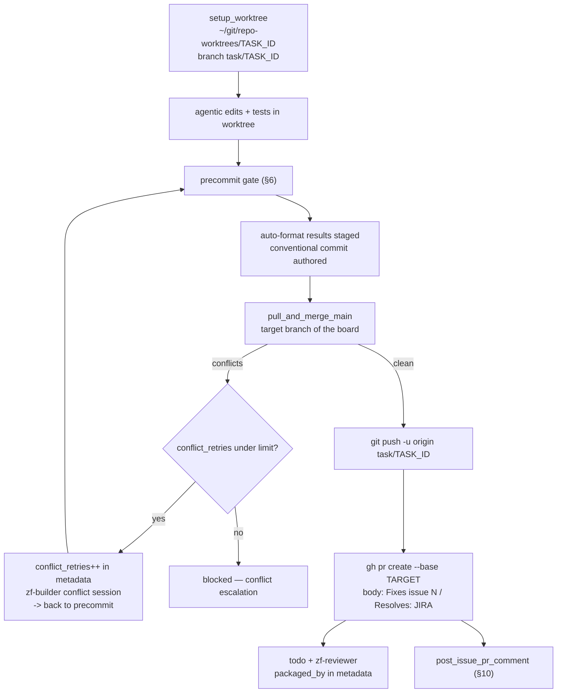

- Worktree removal happens after push/PR (packaging) and on `MERGED`/`CLOSED`/terminal-done.
- Remote branch cleanup: `_delete_remote_branch` on merge/close/manual-done archive.
- Conflict markers left in the worktree are detected (`check_files_for_conflict_markers`) and
  routed back to a builder conflict session instead of being committed.

---

## 8. Thematic Review Loop (agentic review, deterministic routing)

The **reviewer never merges** and never uses `--approve`/`--request-changes` (GitHub blocks
self-approval); it posts `[AI:zf-reviewer]`-prefixed review comments and signals its verdict
with a canonical code (`hermes zerofactory block <id> --reason <code>`). The **dispatcher**
routes on deterministic signals only — GitHub `reviewDecision` (human reviewers) or the
task's `blocked_reason_type` code. Comments are forwarded as content only; a reviewer that
crashes before signaling self-heals via the worker retry budget:

| Signal detected in step 3 | Route |
|---|---|
| `blocked_reason_type == changes-requested` or `reviewDecision == CHANGES_REQUESTED` | `todo` + builder + 🚨 review-comment block (round counter++) |
| `blocked_reason_type == approved` or `reviewDecision == APPROVED` | `blocked` + `human` |
| `commit_review_count > 2` (per commit SHA; resets on new commits) | escalate `blocked` + `human` + `review_cap_reached` |
| Neither (comments only) | record comments only; no routing |

Review rounds are **themed** (round 1: correctness/tests/security/Ponytail gatekeeping;
round 2: verification & polish) and hard-capped — the dispatcher is the enforcement point,
so an agent that ignores the cap still gets escalated to a human.

---

## 9. Terminal `done` Semantics

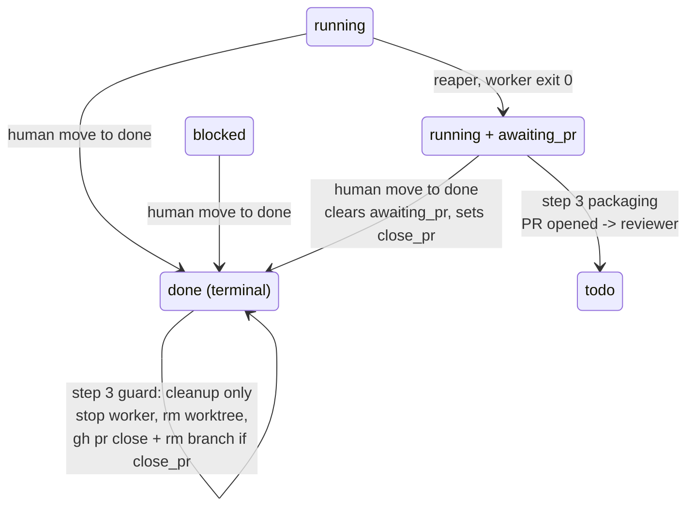

- **Agent** `move done` (actor `zf-*`): "builder finished" → the task stays **`running`** with `awaiting_pr` → packaging pipeline → `todo` + reviewer. `done` appears only after merge/close/human close.
- **Human** `move done` (actor `user`, e.g. drag-and-drop): **terminal** — aborts sessions,
  stops the worker, and if a PR is open sets `close_pr` so the next cycle
  archives the PR (close + branch delete, activity `manual_done`). Never re-dispatched.
- **Reviving** (`move todo/running/...`): clears `awaiting_pr` / `close_pr` and resets
  worker failure bookkeeping; the task dispatches normally again.
- **Delete** remains reserved for invalid/duplicate tickets (erases history).

---

## 10. Issue Ingestion & Feedback (GitHub / Jira)

### Inbound (issue → triage task)

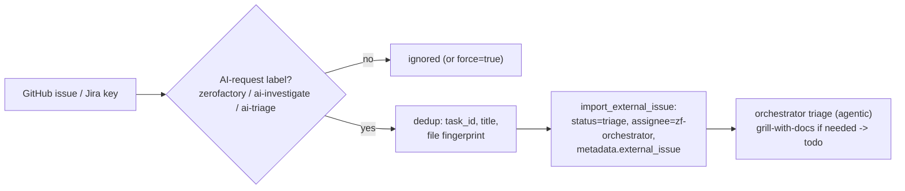

Entry points: dashboard **Sync GitHub Issues**, `import-gh-issue` endpoint/CLI,
and the queue watchdog's rate-limited auto-sync (15-min per-repo cooldown).

### Outbound (PR → source issue reply, "Option B")

When packaging successfully opens a PR for a task with `metadata.external_issue`:

1. Gate: `source == 'github'` + issue id + `has_ai_request` (baked in at import time) + `pr_url`.
2. Dedup: HTML marker `<!-- zf-task:<task_id> -->` — checked against existing issue comments
   via `gh issue view --json comments`; `metadata.issue_pr_comment_posted` as secondary guard.
3. Post exactly **one** comment:
   `🔀 **PR opened** — task <id> is now under review` + PR URL + `Fixes #<id>` + marker
   (`gh issue comment`). Jira is not supported for the reply.
4. Failures are logged warnings — the pipeline never blocks on the reply.

---

## 11. Scheduled Automation (cron, no-agent mode, wake gates)

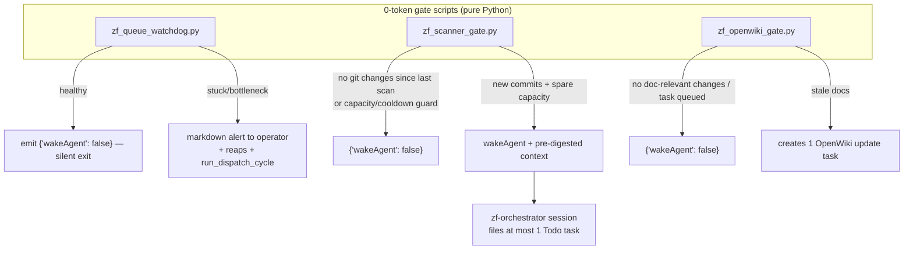

| Job | Cadence | Mode | Suppression conditions | Action when awake |
|---|---|---|---|---|
| `zero-factory-task-queue-check` | 120m | **no-agent** (0 tokens) | healthy queue → `wakeAgent: false` | auto-sync GitHub issues, reap stuck workers, run dispatch cycle, emit stats/alert |
| `zero-factory-improvement-scanner-{slug}` | on-idle / 60m | agent (`zf-orchestrator`, `continuity: false`) | unchanged git state, `running >= 2`, `todo >= 2`, 15m cooldown | file **≤ 1** `Todo` improvement task (categories: bug-fix, refactoring, performance, documentation, testing, security, config) |
| `zero-factory-openwiki-update-{slug}` | daily | agent | docs fresh / task already queued | file 1 OpenWiki refresh task |

Global LLM capacity (`max_concurrent_llm_workers`) counts scanners and cron LLM jobs together
with running tasks — busy boards suppress scans automatically.

---

## 12. Repository Memory (`board_memories`)

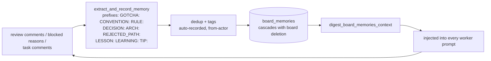

- Categories: `convention`, `gotcha`, `decision`, `rejected_path`, `general`.
- Noise protection: only prefixed lines are extracted; routine approvals are ignored.
- Controls: global setting + per-board `auto_record_memory` toggle (Settings modal / board edit /
  ⚡ button in Agents → Repository Memory).
- CLI: `hermes zerofactory memory list|add|delete`.

---

## 13. Setup Bootstrapping (P0 tasks)

Each board can be bootstrapped with dedicated P0 tasks (deduplicated; dashboard banners or CLI):

| Flow | Command / button | Task delivers | Dedup key |
|---|---|---|---|
| Precommit gate | `hermes zerofactory setup-repo` | `.zerofactory/precommit.sh` (detects tooling; self-bootstrapping pinned tools; format→build→test; `install-hook`) | `setup:precommit` |
| OpenWiki docs | `hermes zerofactory setup-openwiki` | `openwiki/` via OpenWiki MCP lifecycle, linked from `AGENTS.md` | `setup:openwiki` |
| GitHub issue templates | `setup-gh-issues` endpoint | issue templates + labels via worktree → builder → precommit → PR | `setup:gh-issues` |

The precommit setup prompt itself encodes the gate's invariants: pytest-only test runs
(**never** `unittest discover` for pytest suites) and mandatory runtime self-bootstrapping of
the pinned test stack — the dispatcher's bare `python3` may lack project dependencies.

---

## 14. Agentic Roles (summary)

| Profile | Does | Never does | Config highlights |
|---|---|---|---|
| `zf-orchestrator` | triage, decomposition, grill-with-docs interviews, improvement scans | write/review code, mark tasks done | temp 0.0, 120 turns |
| `zf-builder` | implementation, tests, conflict resolution, precommit fixes | git push/PR, review | temp 0.1, 90 turns, OpenWiki MCP |
| `zf-reviewer` | themed PR review (≤2 rounds/commit), Ponytail gatekeeping, memory tips | merge, `--approve`, open PRs | temp 0.0, 60 turns |

All three share the **Ponytail Ladder of Laziness** (7 rungs: YAGNI → reuse → stdlib → native
runtime → installed deps → simple functions → minimum viable diff) via bundled skills.

---

## 15. Environment Knobs (`ZEROFACTORY_*`)

| Variable | Default | Effect |
|---|---|---|
| `ZEROFACTORY_DB` | `~/.hermes/zerofactory.db` | kanban SQLite path |
| `ZEROFACTORY_LOCK_PATH` | under state dir | cross-process dispatch lock |
| `ZEROFACTORY_SKIP_GIT` | unset | disables all git/PR handling (tests) |
| `ZEROFACTORY_SKIP_WORKER_SPAWN` | unset | claim tasks but don't spawn LLM workers |
| `ZEROFACTORY_SKIP_DISPATCHER` / `ZEROFACTORY_DISABLE_DISPATCHER` | unset | don't auto-start/trigger dispatch |
| `ZEROFACTORY_SKIP_PRECOMMIT` | unset | gate returns pass without running |
| `ZEROFACTORY_PRECOMMIT_TIMEOUT_SECONDS` | `300` | gate hard timeout |
| `ZEROFACTORY_MAX_PRECOMMIT_RETRIES` | `3` | self-heal retries before blocking |
| `ZEROFACTORY_MAX_REVIEW_ROUNDS` | `2` | per-commit review rounds before human escalation |
| `ZEROFACTORY_MAX_CONFLICT_RETRIES` | `3` | merge-conflict resolution attempts |
| `ZEROFACTORY_TASK_TIMEOUT_SECONDS` | `3600` | max worker runtime |
| (inactivity) | `900` | max silence before stuck |
| `ZEROFACTORY_MAX_WORKER_RETRIES` | `3` | crash/timeout attempts before `permanently_blocked` |
| `ZEROFACTORY_SKIP_CRON_SYNC` | unset | skip cron job sync on board changes |
| `ZEROFACTORY_SKIP_PRECOMMIT_SETUP` | unset | skip auto precommit-setup task on board create |
| `ZEROFACTORY_SKIP_GH_API` | unset | skip GitHub API calls |

Board settings (per board, DB): `target_branch`, `max_concurrent_running`,
`auto_record_memory`, `additional_reviewer_usernames`, `jira_url`.
Global settings (dashboard): `max_active_tasks`, `max_concurrent_llm_workers`,
Langfuse tracing, auto-record toggle.
